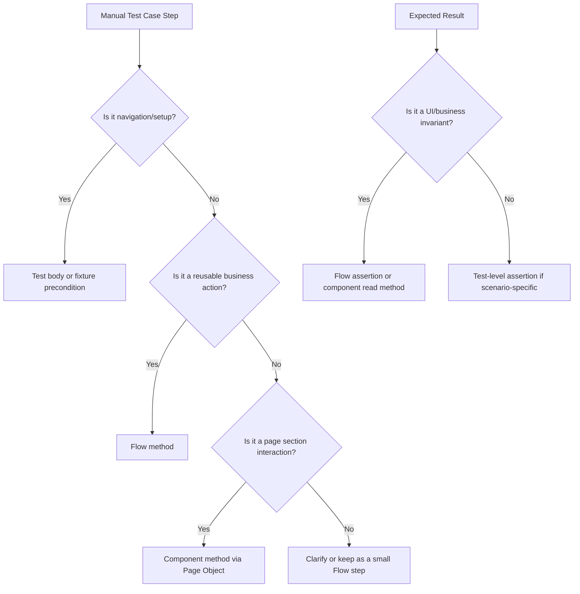

# Generate Test From Test Case File (sdetpro-k14-playwright)

Generates Playwright UI automation from a test case artifact already present in the workspace, translating manual/business steps into this project's layered structure.

See [README.md](../../../README.md) for the framework architecture and [generate-playwright-test](../generate-playwright-test/SKILL.md) for the base UI test generation rules this skill builds on.

## When to use this skill

Use this skill when the user provides or references a test case file and wants an automated Playwright test generated from it.

Examples:
- "Generate a test script from this test case file"
- "Convert these manual test cases into Playwright"
- "Create automation from the checkout test case document"
- "Read the CSV test cases and create specs"

Do not use this skill when:
- The user wants to debug or run an existing test only. Use `web-ui-testing`.
- The user wants a pure API test from an endpoint contract. Use `generate-api-test`.
- The user wants a generic new UI test and no test case file is involved. Use `generate-playwright-test`.

## Supported input

Best-supported source files are text-based files already in the workspace:
- `.md`
- `.txt`
- `.csv`
- `.json`
- `.ts`

If the original test case lives in a binary format such as `.xlsx`, `.docx`, or an image/PDF, first look for an exported text/CSV/Markdown version in the repo. If none exists, ask the user for a text version or extracted content before generating code.

## Required output shape

Generated automation must still follow this repo's architecture:

```
Test Spec (*.spec.ts)
  -> Fixture
    -> Flow
      -> Page Object
        -> Component
          -> Playwright API
Test Spec -> Test Data + Constants
```

Do not flatten manual steps directly into raw Playwright calls in the spec unless the repo already uses that simplified pattern for the exact same area. Reuse existing abstractions first.

## Step 1: Read and normalize the test case

Extract these fields from the test case file when available:
- Test case ID
- Title / scenario name
- Preconditions
- Steps
- Expected result per step or final expected result
- Input data / parameter values
- Priority or tags

Normalize the test case into this working structure before writing code:

```text
Scenario:
Preconditions:
Start route:
Input data:
Business steps:
Assertions:
```

Interpretation rules:
- Combine duplicated prose steps into one reusable business step.
- Separate navigation/setup from assertions.
- Distinguish UI actions from data values.
- Prefer explicit assertions for expected outcomes; do not silently drop expected results from the source test case.
- If a test case mixes multiple independent scenarios, split them into separate tests.

## Step 2: Map the test case to existing framework layers

Before creating new files, inspect what already exists:

1. Search `tests/` for a spec covering the same business scenario.
2. Search `test-flows/` for a Flow that already expresses the workflow.
3. Search `modules/pages/` for Page Objects for the pages named or implied by the test case.
4. Search `modules/components/` for Components matching the controls or UI sections used by the test case.
5. Search `constants/Routes.ts` for the starting page route.
6. Search `test-data/` for reusable data matching the manual test inputs.

Decision rule:
- If the test case can be expressed by an existing Flow, prefer writing only the spec and test data.
- If the workflow is new but pages/components exist, add or extend a Flow.
- If controls are missing, create the smallest missing Component and then expose it through the Page Object.

## Step 3: Convert manual steps into automation-friendly business steps

Manual test cases are often too granular. Rewrite them into business methods at the Flow layer.

Examples:
- "Click Computers, choose Cheap Computer, select 8GB RAM, add to cart" -> one or two Flow methods, not four raw locator actions in the test.
- "Verify subtotal, shipping, tax, and total" -> one Flow assertion method if that validation belongs together.

Mapping guide:



Rules:
- Tests should describe the scenario.
- Flows should describe the business workflow.
- Page Objects should expose page sections/components.
- Components should wrap locators and low-level UI interactions.

## Step 4: Decide how to represent test data

Choose the data shape based on the source test case file:

- Single scenario with fixed values: inline one `test(...)` or create one small JSON object if reuse is likely.
- Multiple rows in CSV/JSON: convert each row into data-driven input using `testData.forEach(...)`.
- Sensitive or environment-specific values such as emails: use a `.ts` wrapper pattern like `DefaultCheckoutUser.ts`, not raw committed secrets.

When the source file contains columns that are not used by automation, keep only fields that matter for execution or test naming.

## Step 5: Generate only the missing layers

Follow the existing generator skill conventions:

- Components: `modules/components/<domain>/...`
- Pages: `modules/pages/...`
- Flows: `test-flows/<domain>/...`
- Test data: `test-data/<domain>/...`
- Specs: `tests/<domain>/...`

Additional rules for test-case-driven generation:
- Preserve traceability by carrying the source test case ID into the test title or a nearby constant when useful.
- Prefer one spec per coherent scenario group from the source document.
- If the test case wording is ambiguous, choose the smallest faithful implementation and state the assumption.
- Do not automate steps that are impossible or non-deterministic without first converting them into a stable assertion/action.

Recommended test name pattern:

```typescript
test('[TC-123] Test checkout with valid card', async ({ page, checkoutFlow }) => {
```

For data-driven cases:

```typescript
testData.forEach(data => {
    test(`[${data.testCaseId}] ${data.scenario}`, async ({ page, myFlow }) => {
```

## Step 6: Handle preconditions correctly

Common precondition mapping:
- "User is on product page" -> `await page.goto(ROUTES.someRoute)` in the test body.
- "User is logged in" -> reuse or add a login-related Flow/fixture only if the repo already supports that pattern.
- "Product exists in cart" -> use Flow methods to build that state instead of bypassing UI unless the existing framework already uses an API/setup shortcut.

Do not hide scenario-specific navigation inside a Page Object fixture. In this repo, navigation belongs in the test body.

## Step 7: Write the spec

Spec rules remain the same as the existing UI generator:
- Import `test` from the Flow file when a Flow fixture exists.
- Use `ROUTES` constants, never hardcoded absolute URLs.
- Keep assertions aligned to the expected result from the source test case.
- Use one test per scenario unless the source file is clearly a data table for the same scenario.

Template:

```typescript
import { test } from '../../test-flows/<domain>/<FlowName>';
import ROUTES from '../../constants/Routes';
import testData from '../../test-data/<domain>/<DataFile>.json';

testData.forEach(data => {
    test(`[${data.testCaseId}] ${data.scenario}`, async ({ page, myFlow }) => {
        await page.goto(ROUTES.someRoute);
        await myFlow.executeScenario(data);
    });
});
```

If the scenario is singular, do not force data-driven structure.

## Step 8: Validate against the source test case

Before finishing, compare the generated automation back to the original test case and confirm:

1. Every important manual step is represented by a test action, Flow method, or precondition.
2. Every important expected result is asserted.
3. The chosen start route matches the scenario precondition.
4. No absolute URL or `page.waitForTimeout()` was introduced.
5. The generated files compile cleanly.
6. The new spec runs with `npx playwright test tests/<domain>/<Feature>Test.spec.ts`.

## Common pitfalls

- **Automating the prose literally**: manual test cases often over-specify clicks and under-specify assertions. Translate intent, do not transcribe blindly.
- **Dropping expected results**: if the source file says what must be verified, add assertions for it.
- **Creating duplicate abstractions**: reuse existing Flows, Pages, and Components whenever possible.
- **Overfitting one manual step per code method**: business flows should stay readable and reusable.
- **Assuming binary office files are directly readable**: use a text-exported version when available, otherwise ask the user for extracted content.
- **Hiding navigation inside fixtures**: this repo expects explicit `page.goto(...)` in the test body.

## Relationship to other skills

- Use this skill when the starting point is a test case file.
- Use [generate-playwright-test](../generate-playwright-test/SKILL.md) when the starting point is only a feature request or scenario description.
- Use [test-data-environment](../test-data-environment/SKILL.md) when the main problem is data modeling or env-overridable inputs.