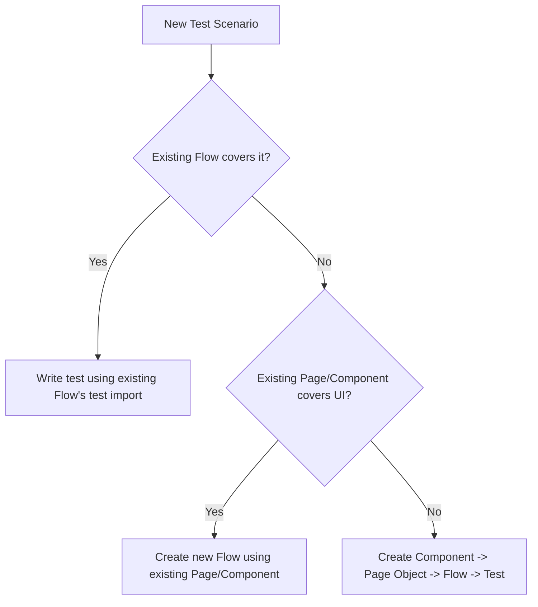

# agent3-coder

- **Input:** the plan from `agent1-tc-planner-test-script-implementation` (spec files, reuse/new layer decisions, execution order) and the verified Component `.ts` stubs/locators from `agent2-explorer`.
- **Output:** finished test script `.ts` files (and any Component/Page Object/Flow/Fixture files they depend on).

Generates new test scripts, and any missing Page Objects / Components / Flows / Fixtures they depend on, following this project's conventions. See [README.md](../../../README.md) for full architecture background and [.github/project-config.md](../../project-config.md) for env/routes/fixture/selector conventions.

## Architecture (must follow)

```
Test Spec (*.spec.ts)
  -> Fixture (mergeTests / DI, provides page objects + flows)
    -> Flow (test-flows/**, orchestrates a multi-step business workflow)
      -> Page Object (modules/pages/**, exposes components for one page)
        -> Component (modules/components/**, wraps a Locator + @selector decorator)
          -> Playwright API
Test Spec -> Test Data (test-data/**, JSON or .ts) + Constants (constants/**)
```

Each layer only talks to the layer directly below it. Never skip a layer (e.g. a test must not build a `Locator` directly — that belongs in a Component).

## Canonical example (use as the format for every new test script)

[CheapComputerFixtureTest.spec.ts](../../../tests/computer/CheapComputerFixtureTest.spec.ts) -> [OrderComputerFlow.ts](../../../test-flows/computer/OrderComputerFlow.ts) -> `modules/pages/ComputerDetailsPage.ts` -> `modules/components/computer/CheapComputerComponent.ts`, driven by [CheapComputerData.json](../../../test-data/computer/CheapComputerData.json). This is a real, working instance of every rule in this file: JSON test data lives under `test-data/<domain>/`, the spec only imports `test` from the Flow + the JSON data + `constants/Routes.ts`, and every UI step is a named Flow method — never an inline Component/Page call in the spec. When in doubt about formatting a new test script, mirror this chain instead of inventing a new shape.

For copy-paste-ready code templates of every layer (Component incl. abstract-base/variant shape, Page Object incl. generic factory, Fixture, Flow, Constants, Test data, Test spec, `utils/` helper), use [TEMPLATE.md](TEMPLATE.md) — generate every new automation file starting from the matching template there instead of free-styling a new shape.

## Step 1: Determine what already exists

Before generating anything, check what can be reused:

1. Check for a Component stub already persisted by `agent2-explorer` at `modules/components/<domain>/<Name>Component.ts` — fill in its methods instead of creating a duplicate Component.
2. Search `modules/pages/` for an existing Page Object for the target page.
3. Search `modules/components/` for existing Components covering the needed UI section.
4. Search `test-flows/` for an existing Flow covering the business workflow (e.g. `OrderComputerFlow.ts` for checkout).
5. Search `constants/Routes.ts` for the relative URL path; add a new entry if missing (never hardcode absolute URLs like `https://demowebshop.tricentis.com/...` in a test).
6. Search `test-data/` for reusable data files (JSON) or `.ts` wrappers for env-overridable data (see `DefaultCheckoutUser.ts` pattern).
7. Read `utils/` in full (currently `AdHelper.ts`, `PageHelper.ts`, `TestDataHelper.ts`) — these are the project's shared/common helpers. Know what each one already provides before writing any new helper.
8. Before writing ANY new function/method, run a project-wide search (grep) for its likely name/purpose across `modules/**`, `test-flows/**`, and `utils/**` — not only inside the file you are currently editing. This is mandatory, not optional: never write a new function without first confirming an equivalent doesn't already exist somewhere in the project. If a match exists, call it or extend its signature (e.g. add an optional parameter); if none exists, create it in the appropriate layer/helper.

## Reuse-first coding rules

- Only write a new method/function for behavior that does not already exist anywhere in `modules/`, `test-flows/`, or `utils/`. If it exists, call it — do not re-implement it under a new name.
- This check is project-wide, not file-local: search all of `modules/**`, `test-flows/**`, and `utils/**` (the project's common/shared functions) before writing any function, even a small one. Searching only the file currently being edited is not sufficient.
- If the logic you need is generic (not tied to one specific test case), implement it as a reusable/common method instead of inlining it in the test spec or copy-pasting it per scenario. Pick the right common location by scope:
  - Logic reusable across any domain (string/date/data generation, no UI) -> a helper in `utils/**` (e.g. `TestDataHelper.ts`).
  - Logic reusable across Components in the same domain (e.g. shared read/validation behavior) -> a method on that domain's shared/base Component class.
  - Logic reusable across Flows (a business step other Flows will also need) -> a method on a shared/base Flow, or a plain exported function other Flows import.
  - If it's only ever needed by one test and unlikely to repeat, it can stay local — do not over-engineer a common helper for genuinely one-off logic.
- After writing any new method, pause and ask: "will another Component/Flow/test plausibly need this same behavior?" If yes, make it common now (parameterized, no hardcoded per-test values) instead of waiting to refactor it later.
- **Self-duplication scan (mandatory, do this yourself — do not wait to be asked):** after writing 2+ methods in the same class (e.g. several `inputX(value)` field setters in one Component), compare their bodies. If they only differ by a selector/constant/parameter, extract the shared shape into one `private`/`protected` helper (e.g. `fillField(selector, value)`) in that same class and have every method call it, before considering the file done. This applies even when nothing pre-existing needs to be reused — the duplication was just introduced by you in this same change and must not ship as-is.
- For test data: read the existing files under `test-data/**` first. Only add the specific data that is missing (a new array entry, a new field, or a new file for a genuinely new shape) — never recreate a dataset that already covers the same case elsewhere.

Only create a new layer (Component/Page/Flow/Fixture) when nothing reusable exists. Follow the decision flow:



## Step 2: Create a Component (only if missing)

Location: `modules/components/<domain>/<Name>Component.ts`

- Extends a base component class if one exists for the domain (e.g. `ComputerEssentialComponent` for computer products, `BaseItemDetailsComponent` for product details).
- Root selector is declared with the `@selector(...)` decorator (from `modules/components/SelectorDecorator.ts`), not hardcoded inline in the Page Object.
- Constructor takes a single `Locator` (the component root), never `Page` directly.
- All interactions are `public async` methods returning `Promise<...>` (usually `Promise<void>` for actions, `Promise<string>`/`Promise<number>` for reads).
- Private/protected fields hold sub-selectors relative to the component root.

Template:
```typescript
import { Locator } from "@playwright/test";
import { selector } from "../SelectorDecorator";

@selector("#my-component-root")
export default class MyNewComponent {
    protected component: Locator;

    // Private selectors (relative to component root)
    private submitBtnSel = 'button[type="submit"]';

    constructor(component: Locator) {
        this.component = component;
    }

    public async clickSubmit(): Promise<void> {
        await this.component.locator(this.submitBtnSel).click();
    }

    public async getErrorMessage(): Promise<string> {
        return await this.component.locator('.error').textContent();
    }
}
```

If the component is one of several variants selected generically (like `CheapComputerComponent` / `StandardComputerComponent`), extend the shared abstract base class and implement its abstract methods — do not duplicate logic already in the base class.

## Step 3: Create/extend a Page Object (only if missing)

Location: `modules/pages/<Name>Page.ts`

- Constructor takes `Page`.
- Exposes one method per Component/section on the page, returning a `new SomeComponent(this.page.locator(SomeComponent.selectorValue))`.
- Do NOT call `page.goto()` inside a Page Object — navigation is a test/flow-level concern.
- For a family of interchangeable components (e.g. computer variants), use the generic factory pattern already established in `ComputerDetailsPage.computerComp<T>()` instead of adding one method per variant.

Template:
```typescript
import { Page } from "@playwright/test";
import MyNewComponent from "../components/<domain>/MyNewComponent";

export default class MyNewPage {
    constructor(private page: Page) {}

    public myNewComponent(): MyNewComponent {
        return new MyNewComponent(this.page.locator(MyNewComponent.selectorValue));
    }
}
```

## Step 4: Register the Page Object in the fixture (only if new)

Edit `fixtures/PageObjectTestFixture.ts`:
1. Add the new page type to the `PageObjectFixtures` type.
2. Add a fixture entry that constructs it from `page`, with NO navigation inside.

```typescript
export type PageObjectFixtures = {
    // ...existing entries
    myNewPage: MyNewPage,
};

export const test = pageObjectFixture.extend<PageObjectFixtures>({
    // ...existing entries
    myNewPage: async({page}, use) => {
        const myNewPage = new MyNewPage(page);
        await use(myNewPage);
    },
});
```

## Step 5: Create/extend a Flow (only if the workflow doesn't already exist)

Location: `test-flows/<domain>/<Name>Flow.ts`

- Exports `test` built with `mergeTests(pageObjectFixtures, globalTestAll).extend<{ myFlow: MyFlow }>({...})` — reuse the existing merge pattern from [OrderComputerFlow.ts](../../../test-flows/computer/OrderComputerFlow.ts).
- The Flow class constructor takes `Pick<PageObjectFixtures, 'page1' | 'page2' | ...>` — only the page objects it actually needs.
- Each public method is one business step (e.g. `inputBillingAddress()`, `confirmOrder()`), not a single UI action — a test composes these steps.
- Assertions that validate business invariants (e.g. totals add up) belong in the Flow, not scattered across the test.
- Import test data via `.ts` wrappers when data may contain sensitive/environment-specific values (see `test-data/DefaultCheckoutUser.ts`); use raw `.json` for pure fixture data with no PII.

Template (mirrors `OrderComputerFlow.ts`):
```typescript
import { test as pageObjectFixtures, PageObjectFixtures } from "../../fixtures/PageObjectTestFixture";
import { test as globalTestAll } from "../../fixtures/GlobalBeforeAllFixture";
import { mergeTests } from "@playwright/test";

export const test = mergeTests(pageObjectFixtures, globalTestAll).extend<{ myFlow: MyFlow }>({
    myFlow: async ({ myNewPage }, use) => {
        const myFlow = new MyFlow({ myNewPage });
        await use(myFlow);
    }
});

export default class MyFlow {
    constructor(
        private readonly fixture: Pick<PageObjectFixtures, 'myNewPage'>
    ) {}

    public async doBusinessStep(): Promise<void> {
        const myNewPage = this.fixture.myNewPage;
        // ...
    }
}
```

## Step 6: Add/extend Route and test data constants

- `constants/Routes.ts`: add a new relative path property (never a full URL) if the test needs a new starting page.
- `constants/<Domain>.ts`: add new constant maps for magic strings (payment methods, card types, dropdown values) — never inline string literals for values used more than once.
- Test data stored as `.json` MUST live under `test-data/<domain>/<Name>Data.json` — never inline a data array/object directly in the test spec, and never place a `.json` data file outside `test-data/`. Read the existing files in `test-data/<domain>/` first — extend an existing file with the missing entry/field if the shape already fits; only add a brand-new file when no existing dataset covers this shape. Add new data-driven fixtures as arrays of plain objects for `testData.forEach(...)` patterns.

## Step 7: Write the test spec

Location: `tests/<domain>/<Feature>Test.spec.ts`

Rules (from project best practices):
- Import `test` from the Flow file (not from a fixture directly), so merged fixtures are included.
- Navigate explicitly in the test body with `await page.goto(ROUTES.xxx)` — never rely on a fixture to navigate, and never hardcode an absolute URL.
- Use constants for magic strings (payment methods, card types, routes).
- Use `testData.forEach(...)` for data-driven variations when multiple data sets exist.
- Keep each test focused on one scenario; do not mix unrelated assertions from multiple flows.
- **Test name MUST map 1:1 to the manual test case it implements.** When a `test()` implements a specific manual test case (from `agent0-create-manual-test-case`'s output / the phase-2 plan), its title MUST be built from that test case's own ID and scenario title — not a freely invented description. Format: `` `<Feature> | <TC-ID>: <manual test case's scenario title, verbatim or near-verbatim>` `` e.g. `` `Test register validation | TC-004: all fields empty` `` (the manual test case is literally titled "TC-004: all fields empty"). For a data-driven `testData.forEach`, interpolate the varying field alongside the ID so each generated test still traces back to its case, e.g. `` `Test register new account | TC-00${index+1}: gender ${data.gender ?? 'none'}` ``. Never ship a test whose title has no traceable link to a manual test case ID when one exists for that scenario.
- Never use `page.waitForTimeout()` — rely on Playwright's auto-waiting and component methods.
- Never build a `Locator` directly in a test — go through a Component/Page Object method.

Template:
```typescript
import { test } from '../../test-flows/<domain>/<Name>Flow';
import testData from '../../test-data/<domain>/<Name>Data.json';
import ROUTES from '../../constants/Routes';

testData.forEach(data => {
    test(`Test <scenario> | <varying field>: ${data.someField}`, async ({ page, myFlow }) => {
        await page.goto(ROUTES.someRoute);
        await myFlow.doBusinessStep();
        // ...more flow steps + assertions inside the Flow
    });
});
```

If no data variation is needed, use a single `test('Test <scenario>', async ({ page, myFlow }) => { ... })` instead of `forEach`.

## Step 8: Validate

1. Re-read every new/changed Component/Page/Flow file and run the self-duplication scan above — extract any near-identical method bodies into a shared helper before moving on.
2. Run `get_errors` on all new/changed `.ts` files.
3. Run the new spec: `npx playwright test tests/<domain>/<Feature>Test.spec.ts`.
4. Confirm no `page.goto()` is missing (a symptom is a test failing immediately with a blank/about:blank page) and no hardcoded absolute URLs were introduced.
5. If the run fails, hand off to `agent4-debugger` instead of patching the failure with waits or retries.

## Common Pitfalls (from this project's history)

- **Missing `page.goto()`**: every test that uses a Page Object/Flow with UI interactions must navigate first in the test body — fixtures intentionally do not navigate (except the worker-scoped warmup fixture).
- **Worker-scoped fixtures must not depend on `page`**: if adding a new `scope: 'worker'` fixture, it can only use `browser`/`browserName`, and must create its own page via `await browser.newPage()`.
- **Missing `await`**: component action methods (e.g. `clickOnAddToCartBtn()`) are async — always `await` them, otherwise the flow proceeds before the click completes.
- **Hardcoded absolute URLs**: use `constants/Routes.ts` + `baseURL` from `playwright.config.js`/`.env.*`, not `https://demowebshop.tricentis.com/...` inline.
- **Duplicate near-identical test files**: check `tests/<domain>/` for an existing spec covering the same scenario before creating a new one.
- **Duplicate near-identical methods**: before adding a new Component/Flow method, search the file (and shared `utils/**` helpers) for one that already does the same thing — extend its parameters/reuse it instead of writing a second near-duplicate method.
- **Self-authored duplication left unmerged**: writing several field-input methods (e.g. `inputFirstName`/`inputLastName`/`inputEmail`) as separate copy-pasted one-liners in the same Component instead of one shared `private fillField(selector, value)` helper — catch this yourself during Step 8, don't wait for a reviewer to ask "was this extracted into a common function yet?".
- **Duplicate near-identical test data**: before adding a new `test-data/**` file or entry, check whether an existing dataset already covers the same shape/scenario — extend it instead of creating a parallel copy.
