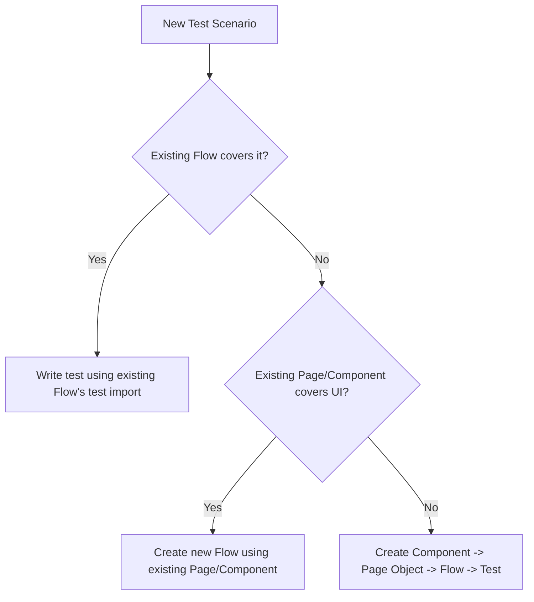

# Generate Playwright Test (sdetpro-k14-playwright)

Generates new test scripts, and any missing Page Objects / Components / Flows / Fixtures they depend on, following this project's conventions. See [README.md](../../../README.md) for full architecture background.

## Architecture (must follow)

```
Test Spec (*.spec.ts)
  -> Fixture (mergeTests / DI, provides page objects + flows)
    -> Flow (test-flows/**, orchestrates a multi-step business workflow)
      -> Page Object (modules/pages/**, exposes components for one page)
        -> Component (modules/components/**, wraps a Locator + @selector decorator)
          -> Playwright API
Test Spec -> Test Data (test-data/**, JSON or .ts) + Constants (constants/**)
```

Each layer only talks to the layer directly below it. Never skip a layer (e.g. a test must not build a `Locator` directly — that belongs in a Component).

## Step 1: Determine what already exists

Before generating anything, check what can be reused:

1. Search `modules/pages/` for an existing Page Object for the target page.
2. Search `modules/components/` for existing Components covering the needed UI section.
3. Search `test-flows/` for an existing Flow covering the business workflow (e.g. `OrderComputerFlow.ts` for checkout).
4. Search `constants/Routes.ts` for the relative URL path; add a new entry if missing (never hardcode absolute URLs like `https://demowebshop.tricentis.com/...` in a test).
5. Search `test-data/` for reusable data files (JSON) or `.ts` wrappers for env-overridable data (see `DefaultCheckoutUser.ts` pattern).

Only create a new layer (Component/Page/Flow/Fixture) when nothing reusable exists. Follow the decision flow:



## Step 2: Create a Component (only if missing)

Location: `modules/components/<domain>/<Name>Component.ts`

- Extends a base component class if one exists for the domain (e.g. `ComputerEssentialComponent` for computer products, `BaseItemDetailsComponent` for product details).
- Root selector is declared with the `@selector(...)` decorator (from `modules/components/SelectorDecorator.ts`), not hardcoded inline in the Page Object.
- Constructor takes a single `Locator` (the component root), never `Page` directly.
- All interactions are `public async` methods returning `Promise<...>` (usually `Promise<void>` for actions, `Promise<string>`/`Promise<number>` for reads).
- Private/protected fields hold sub-selectors relative to the component root.

Template:
```typescript
import { Locator } from "@playwright/test";
import { selector } from "../SelectorDecorator";

@selector("#my-component-root")
export default class MyNewComponent {
    protected component: Locator;

    // Private selectors (relative to component root)
    private submitBtnSel = 'button[type="submit"]';

    constructor(component: Locator) {
        this.component = component;
    }

    public async clickSubmit(): Promise<void> {
        await this.component.locator(this.submitBtnSel).click();
    }

    public async getErrorMessage(): Promise<string> {
        return await this.component.locator('.error').textContent();
    }
}
```

If the component is one of several variants selected generically (like `CheapComputerComponent` / `StandardComputerComponent`), extend the shared abstract base class and implement its abstract methods — do not duplicate logic already in the base class.

## Step 3: Create/extend a Page Object (only if missing)

Location: `modules/pages/<Name>Page.ts`

- Constructor takes `Page`.
- Exposes one method per Component/section on the page, returning a `new SomeComponent(this.page.locator(SomeComponent.selectorValue))`.
- Do NOT call `page.goto()` inside a Page Object — navigation is a test/flow-level concern.
- For a family of interchangeable components (e.g. computer variants), use the generic factory pattern already established in `ComputerDetailsPage.computerComp<T>()` instead of adding one method per variant.

Template:
```typescript
import { Page } from "@playwright/test";
import MyNewComponent from "../components/<domain>/MyNewComponent";

export default class MyNewPage {
    constructor(private page: Page) {}

    public myNewComponent(): MyNewComponent {
        return new MyNewComponent(this.page.locator(MyNewComponent.selectorValue));
    }
}
```

## Step 4: Register the Page Object in the fixture (only if new)

Edit `fixtures/PageObjectTestFixture.ts`:
1. Add the new page type to the `PageObjectFixtures` type.
2. Add a fixture entry that constructs it from `page`, with NO navigation inside.

```typescript
export type PageObjectFixtures = {
    // ...existing entries
    myNewPage: MyNewPage,
};

export const test = pageObjectFixture.extend<PageObjectFixtures>({
    // ...existing entries
    myNewPage: async({page}, use) => {
        const myNewPage = new MyNewPage(page);
        await use(myNewPage);
    },
});
```

## Step 5: Create/extend a Flow (only if the workflow doesn't already exist)

Location: `test-flows/<domain>/<Name>Flow.ts`

- Exports `test` built with `mergeTests(pageObjectFixtures, globalTestAll).extend<{ myFlow: MyFlow }>({...})` — reuse the existing merge pattern from [OrderComputerFlow.ts](../../../test-flows/computer/OrderComputerFlow.ts).
- The Flow class constructor takes `Pick<PageObjectFixtures, 'page1' | 'page2' | ...>` — only the page objects it actually needs.
- Each public method is one business step (e.g. `inputBillingAddress()`, `confirmOrder()`), not a single UI action — a test composes these steps.
- Assertions that validate business invariants (e.g. totals add up) belong in the Flow, not scattered across the test.
- Import test data via `.ts` wrappers when data may contain sensitive/environment-specific values (see `test-data/DefaultCheckoutUser.ts`); use raw `.json` for pure fixture data with no PII.

Template (mirrors `OrderComputerFlow.ts`):
```typescript
import { test as pageObjectFixtures, PageObjectFixtures } from "../../fixtures/PageObjectTestFixture";
import { test as globalTestAll } from "../../fixtures/GlobalBeforeAllFixture";
import { mergeTests } from "@playwright/test";

export const test = mergeTests(pageObjectFixtures, globalTestAll).extend<{ myFlow: MyFlow }>({
    myFlow: async ({ myNewPage }, use) => {
        const myFlow = new MyFlow({ myNewPage });
        await use(myFlow);
    }
});

export default class MyFlow {
    constructor(
        private readonly fixture: Pick<PageObjectFixtures, 'myNewPage'>
    ) {}

    public async doBusinessStep(): Promise<void> {
        const myNewPage = this.fixture.myNewPage;
        // ...
    }
}
```

## Step 6: Add/extend Route and test data constants

- `constants/Routes.ts`: add a new relative path property (never a full URL) if the test needs a new starting page.
- `constants/<Domain>.ts`: add new constant maps for magic strings (payment methods, card types, dropdown values) — never inline string literals for values used more than once.
- `test-data/<domain>/<Name>Data.json`: add new data-driven fixtures as arrays of plain objects for `testData.forEach(...)` patterns.

## Step 7: Write the test spec

Location: `tests/<domain>/<Feature>Test.spec.ts`

Rules (from project best practices):
- Import `test` from the Flow file (not from a fixture directly), so merged fixtures are included.
- Navigate explicitly in the test body with `await page.goto(ROUTES.xxx)` — never rely on a fixture to navigate, and never hardcode an absolute URL.
- Use constants for magic strings (payment methods, card types, routes).
- Use `testData.forEach(...)` for data-driven variations when multiple data sets exist.
- Keep each test focused on one scenario; do not mix unrelated assertions from multiple flows.
- Use descriptive test names that include the varying parameter, e.g. `` `Test Cheap computer component | RAM: ${computerData.ram}` ``.
- Never use `page.waitForTimeout()` — rely on Playwright's auto-waiting and component methods.
- Never build a `Locator` directly in a test — go through a Component/Page Object method.

Template:
```typescript
import { test } from '../../test-flows/<domain>/<Name>Flow';
import testData from '../../test-data/<domain>/<Name>Data.json';
import ROUTES from '../../constants/Routes';

testData.forEach(data => {
    test(`Test <scenario> | <varying field>: ${data.someField}`, async ({ page, myFlow }) => {
        await page.goto(ROUTES.someRoute);
        await myFlow.doBusinessStep();
        // ...more flow steps + assertions inside the Flow
    });
});
```

If no data variation is needed, use a single `test('Test <scenario>', async ({ page, myFlow }) => { ... })` instead of `forEach`.

## Step 8: Validate

1. Run `get_errors` on all new/changed `.ts` files.
2. Run the new spec: `npx playwright test tests/<domain>/<Feature>Test.spec.ts`.
3. Confirm no `page.goto()` is missing (a symptom is a test failing immediately with a blank/about:blank page) and no hardcoded absolute URLs were introduced.

## Common Pitfalls (from this project's history)

- **Missing `page.goto()`**: every test that uses a Page Object/Flow with UI interactions must navigate first in the test body — fixtures intentionally do not navigate (except the worker-scoped warmup fixture).
- **Worker-scoped fixtures must not depend on `page`**: if adding a new `scope: 'worker'` fixture, it can only use `browser`/`browserName`, and must create its own page via `await browser.newPage()`.
- **Missing `await`**: component action methods (e.g. `clickOnAddToCartBtn()`) are async — always `await` them, otherwise the flow proceeds before the click completes.
- **Hardcoded absolute URLs**: use `constants/Routes.ts` + `baseURL` from `playwright.config.js`/`.env.*`, not `https://demowebshop.tricentis.com/...` inline.
- **Duplicate near-identical test files**: check `tests/<domain>/` for an existing spec covering the same scenario before creating a new one.
