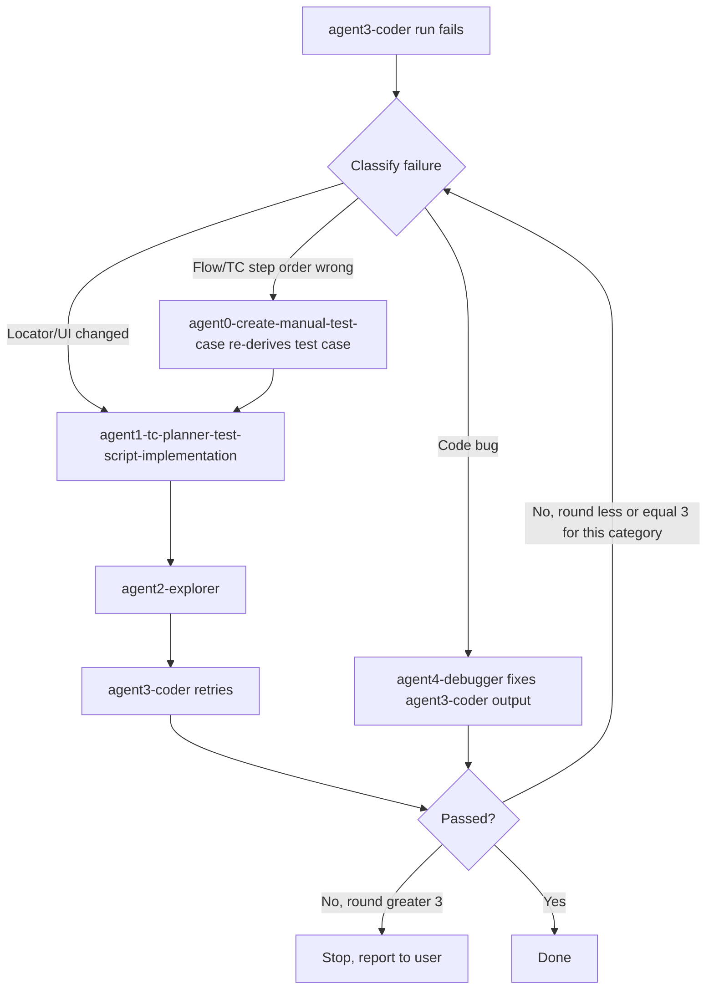

# Agent Failure Routing Workflow

Defines where the pipeline goes back to when `agent3-coder`'s generated test run fails, so a failure retries the correct phase instead of blindly re-running the whole pipeline or retrying forever.

## Routing table

| Failure signal | Route back to | Notes |
|---|---|---|
| Selector no longer matches the live DOM, or the UI layout/route changed | `agent1-tc-planner-test-script-implementation` -> `agent2-explorer` -> `agent3-coder` | Re-plan first (a UI change can also change which layers are reusable), then re-inspect the live elements, then regenerate code with the fresh locators. |
| Code-level bug (syntax/logic error, missing `await`, wrong assertion) — selectors and business flow are correct | `agent4-debugger` fixes `agent3-coder`'s output directly | Max 3 rounds. Do not re-plan or re-explore for a pure code bug. |
| Wrong business flow / test case step order (the manual test case itself is out of order or missing a step) | `agent0-create-manual-test-case` re-derives/corrects the affected test case | The corrected test case then flows through phases 2-4 again. |
| Any single category has failed more than 3 rounds | Stop and report to the user | Include the failure classification history, evidence, and blocker. Do not keep retrying silently or switch category to avoid the cap. |

## Decision flow

## Rules

- Track the round count **per failure category**, not globally — a locator fix and a code fix are separate counters. A category resets to 0 once its own fix produces a pass.
- Never guess the category; classify from the actual terminal output, HTML report, and trace — the same evidence sources `agent4-debugger` already reads.
- Re-plan/re-derive (`agent0`/`agent1`) is a heavier action than a code fix (`agent4-debugger`) — only escalate to it when the evidence points at test-case content, business flow order, or spec/layer grouping, not at the code itself.
- When the 3-round cap is hit for any single category, stop immediately — do not silently switch to a different category just to keep retrying.
- This workflow only governs what happens **after** `agent3-coder` has produced a run that failed; it does not replace `agent4-debugger`'s own layer-classification rules (route/fixture/flow/page/component/selector/data/environment) — it decides which *agent phase* handles the fix, not which *code layer*.

## Consumed by

[playwright-requirement-to-test.agent.md](../agents/playwright-requirement-to-test.agent.md) — Phase 5 (Execute and debug).
