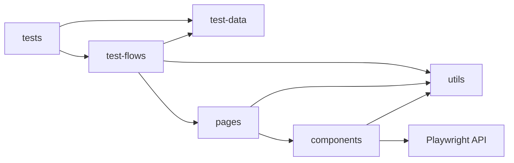
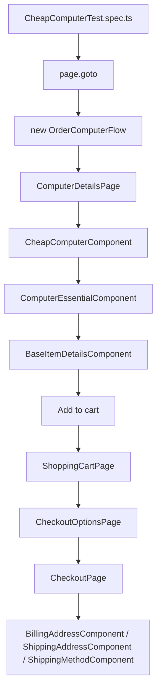

# Automation Framework Handbook - SDETPRO-K14-PLAYWRIGHT

## 1. Muc dich cua handbook

Tai lieu nay giai thich toan bo framework automation test cua project `sdetpro-k14-playwright` duoi goc nhin Senior Automation Test Architect, de ban co the:

- hieu framework dang duoc thiet ke nhu the nao
- maintain code ma khong bi mat context
- viet them test moi dung convention
- nhin ra diem manh, diem yeu, code smell va co hoi refactor

Framework nay la Playwright framework theo huong tach lop:

- test scenario
- business flow
- page object
- component object
- test data

## 2. Tong quan framework

### 2.1 Tech stack

Framework hien tai su dung:

- Node.js runtime
- Playwright Test (`@playwright/test`)
- TypeScript syntax cho test/framework files
- JSON cho test data
- HTML report cua Playwright
- Video, screenshot, trace khi retry/fail theo config

File lien quan:

- `package.json`
- `playwright.config.js`
- `playwright.config.ts`

### 2.2 Thu vien va tool dang dung

Tu `package.json`, dependency chinh hien tai la:

- `@playwright/test`

### 2.2.1 Thu vien toi thieu can co cho 1 Playwright automation project

Neu xay framework Playwright o muc co the maintain va mo rong duoc, toi khuyen nghi chia thu vien thanh 3 nhom:

#### Nhom bat buoc

- `@playwright/test`: test runner, fixtures, assertions, projects, trace, screenshot, video
- `typescript`: type safety cho framework code
- `@types/node`: typing cho Node.js environment

Day la bo toi thieu de xay 1 project nghiem tuc, ngay ca khi project chua can thu vien phu tro nao khac.

#### Nhom rat nen co

- `dotenv`: quan ly bien moi truong nhu `BASE_URL`, account test, feature flags
- `zod` hoac `joi`: validate shape cua test data JSON
- `faker` hoac `@faker-js/faker`: sinh data test dong
- `eslint`: giu code framework sach va dong nhat
- `prettier`: chuan hoa format code

#### Nhom tuy chon theo nhu cau du an

- `allure-playwright`: neu can report manh hon report mac dinh
- `playwright-qase-reporter` hoac reporter khac: neu can tich hop test management
- `axios`: neu can API-assisted setup/cleanup
- `cross-env`: neu can chay scripts cross-platform voi env vars

### 2.2.2 Danh gia repo hien tai theo bo thu vien can co

Repo hien tai moi co:

- `@playwright/test`

Framework hien tai dang chay theo huong toi gian:

- Playwright runner la dependency chinh
- file test/framework viet theo TypeScript syntax
- chua co bo tooling day du cho TypeScript/lint/format/env validation

Dieu nay phu hop voi muc tieu hoc va thuc hanh framework, nhung neu muon maintain lau dai hon thi nen bo sung:

1. `typescript`
2. `@types/node`
3. `dotenv`
4. `zod`
5. `eslint`
6. `prettier`

### 2.3 Kien truc tong the

Framework duoc chia thanh 5 tang chinh:

1. `tests/`
2. `test-data/`
3. `test-flows/`
4. `modules/pages/`
5. `modules/components/`

Mo hinh nay rat hop ly cho UI automation vi no tach ro:

- test mo ta scenario
- flow mo ta nghiep vu
- page mo ta trang
- component mo ta khu vuc UI
- data tach khoi script

### 2.4 Cac design pattern dang duoc su dung

#### Page Object Model
Page duoc mo hinh hoa thanh class, vi du:

- `modules/pages/HomePage.ts`
- `modules/pages/ComputerDetailsPage.ts`
- `modules/pages/ShoppingCartPage.ts`
- `modules/pages/CheckoutPage.ts`

Muc dich:

- giam duplicate locator
- tang tai su dung
- giup test doc nhu nghiep vu

#### Component Object Pattern
Ngoai Page Object, project di sau hon bang cach tach component trong trang thanh class rieng:

- `modules/components/global/header/HeaderComponent.ts`
- `modules/components/global/header/SearchComponent.ts`
- `modules/components/global/footer/FootetComponent.ts`
- `modules/components/cart/TotalComponent.ts`
- `modules/components/computer/CheapComputerComponent.ts`

Muc dich:

- page lon khong bi phinh to
- tai su dung cung mot widget tren nhieu page
- phan tich UI theo khu vuc

#### Base Class + Inheritance
Framework su dung ke thua de chia se hanh vi chung:

- `BaseItemDetailsComponent`
- `ComputerEssentialComponent`
- `CheapComputerComponent`
- `StandardComputerComponent`

Muc dich:

- gom hanh vi chung vao base
- cho phep concrete component override phan khac nhau

#### Template Method style
`ComputerEssentialComponent` dinh nghia contract va mot phan implementation chung:

- `selectProcessorType()` la abstract
- `selectRAMType()` la abstract
- `selectHDDType()` dung chung
- `selectOSType()` dung chung
- `selectSoftwareType()` dung chung

Muc dich:

- bat buoc child class implement phan khac biet
- giu logic chung o parent class

#### Simple Factory with Generics
`ComputerDetailsPage.computerComp<T>()` nhan vao component class va tra ve dung instance component do.

Muc dich:

- 1 page co the phuc vu nhieu loai computer component
- tang type safety
- tranh if/else theo product type

#### Decorator for selector metadata
`SelectorDecorator.ts` attach `selectorValue` vao class bang decorator `@selector(...)`.

Muc dich:

- cho phep page object biet selector root cua component
- tach metadata selector khoi noi su dung

Luu y: y tuong tot, nhung implementation hien tai con rat nhe va chua co type safety tot.

## 3. Cau truc thu muc

### 3.0 Structure project hien tai

Duoi day la structure thuc te cua repo o thoi diem phan tich:

```text
.
|-- e2e/
|-- modules/
|   |-- components/
|   |   |-- BaseItemDetailsComponent.ts
|   |   |-- ProductItemComponent.ts
|   |   |-- PageBodyComponent.ts
|   |   |-- SelectorDecorator.ts
|   |   |-- cart/
|   |   |-- checkout/
|   |   |-- computer/
|   |   `-- global/
|   `-- pages/
|-- test-data/
|   |-- DefaultCheckoutUser.json
|   `-- computer/
|       |-- CheapComputerData.json
|       `-- StandardComputerData.json
|-- test-flows/
|   `-- computer/
|       `-- OrderComputerFlow.ts
|-- tests/
|   |-- computer/
|   |   |-- CheapComputerTest.spec.ts
|   |   `-- StandardComputerTest.spec.ts
|   `-- global/
|-- utils/
|   |-- AdHelper.ts
|   `-- PageHelper.ts
|-- playwright.config.js
|-- playwright.config.ts
|-- README.md
|-- README_AUTOMATION_PROJECT.md
`-- package.json
```

### 3.1 Y nghia structure hien tai

Structure hien tai dang phan tach theo dung huong cua 1 UI automation framework co tang lop:

- `tests/`: chua spec file va scenario
- `test-data/`: chua input data JSON
- `test-flows/`: chua business flows dung lai duoc
- `modules/pages/`: chua page objects
- `modules/components/`: chua component objects va base components
- `utils/`: helper functions nho
- `e2e/`: folder con lai tu config Playwright cu, hien khong phai diem chay chinh

Neu chi dung theo structure hien tai, framework nay da du de hoc, maintain co ban va phat trien tiep tren domain UI testing.

### 3.2 Structure nen bo sung neu muon nang cap framework

Neu muon nang cap tu structure hien tai len muc production-friendly hon, co the bo sung them cac folder sau:

```text
project-root/
|-- fixtures/
|-- constants/
|-- types/
|-- storage-states/
|-- snapshots/
|-- tsconfig.json
|-- eslint.config.js
|-- .env
`-- .env.example
```

Y nghia cac phan nen bo sung:

- `fixtures/`: custom Playwright fixtures
- `constants/`: selector constants, route constants, message constants, timeout constants
- `types/`: interface/type definitions cho data va fixtures
- `storage-states/`: luu session login da duoc auth san
- `snapshots/`: visual snapshots neu co visual testing
- `tsconfig.json`: chuan hoa TypeScript compiler behavior
- `eslint.config.js`: chuan hoa lint rules cho framework
- `.env` va `.env.example`: quan ly bien moi truong an toan va de onboarding

### 3.3 Danh gia structure hien tai so voi structure mo rong

Repo hien tai da co nen tang tot:

- `tests/`
- `test-data/`
- `test-flows/`
- `modules/pages/`
- `modules/components/`
- `utils/`

Nhung nhung phan sau hien chua co hoac chua duoc su dung lam layer rieng:

- `fixtures/`
- `types/`
- `constants/`
- `storage-states/`
- `.env` va `.env.example`
- `tsconfig.json`
- `eslint`/`prettier` config

Ket luan technical:

- structure hien tai hop ly cho muc tieu hoc va phat trien framework theo Page Object + Component Object + Flow
- structure hien tai chua du cho nhu cau scale team, scale env, scale data va CI/CD chat che
- nen xem cac folder bo sung la buoc nang cap tiep theo, khong phai dieu kien bat buoc de framework hien tai hoat dong

### 3.4 Cac file config dang co va nen co

Cac file config dang co trong repo hien tai:

- `package.json`
- `playwright.config.js`
- `playwright.config.ts`

Cac file config nen co them neu muon chuan hoa hon:

- `tsconfig.json`
- `.env`
- `.env.example`
- `eslint.config.js` hoac `.eslintrc.*`
- `.prettierrc`
- `global.setup.ts`
- `global.teardown.ts`

Luu y voi project nay:

- file dang phu hop voi source structure hien tai la `playwright.config.js` vi `testDir = './tests'`
- `playwright.config.ts` hien dang tro toi `./e2e`, nen no thuoc nhom config cu hoac config demo
- neu khong chuan hoa lai, nguoi maintain rat de chay nham config

### 3.5 Script package.json nen map theo project hien tai

Repo hien tai dang co scripts:

```json
{
    "scripts": {
        "test": "playwright test --headed",
        "ui": "playwright test --ui"
    }
}
```

Van de la cac scripts nay chua chi ro file config dang dung.

Neu refactor theo structure hien tai, scripts nen duoc map nhu sau:

```json
{
    "scripts": {
        "test": "playwright test --config=playwright.config.js",
        "test:headed": "playwright test --config=playwright.config.js --headed",
        "test:ui": "playwright test --config=playwright.config.js --ui",
        "test:debug": "playwright test --config=playwright.config.js --debug",
        "test:cheap-computer": "playwright test tests/computer/CheapComputerTest.spec.ts --config=playwright.config.js",
        "test:standard-computer": "playwright test tests/computer/StandardComputerTest.spec.ts --config=playwright.config.js",
        "report": "playwright show-report",
        "lint": "eslint .",
        "format": "prettier --write ."
    }
}
```

So voi project hien tai, uu tien cap nhat truoc la:

- script chi ro config chinh
- debug script
- report script
- lint/format scripts

### Moi quan he phu thuoc giua cac layer

Day la phan quan trong nhat de maintain framework ma khong lam vo kien truc.

Huong phu thuoc dung trong project nay nen la:

```text
tests
    -> test-flows
    -> test-data

test-flows
    -> modules/pages
    -> test-data

modules/pages
    -> modules/components

modules/components
    -> Playwright Locator/Page API
    -> base components

utils
    -> duoc phep duoc goi boi pages/components/flows khi thuc su can
```

So do don gian:



Nguyen tac can nho:

- `tests/` khong nen chua locator chi tiet
- `tests/` khong nen thao tac truc tiep voi DOM neu da co flow/page/component
- `test-flows/` nen noi theo ngon ngu nghiep vu, khong nen giu selector
- `modules/pages/` khong nen om full business flow
- `modules/pages/` chu yeu dong vai tro composition root cua page
- `modules/components/` la noi chua locator va low-level actions
- `test-data/` la input, khong chua logic

Đây là một Playwright framework theo layered automation architecture. Spec files giữ scenario orchestration. Flow classes giữ business journeys. Page objects là page-level composition roots. Component objects là UI interaction units. JSON files là externalized test inputs. Kiến trúc này tối ưu cho maintainability, reuse và scale theo domain, đặc biệt khi một page có nhiều section và một business flow đi qua nhiều screen.

### Quan he phu thuoc cu the trong CheapComputer flow

Trong `CheapComputerTest.spec.ts`, dependency direction hien tai la:

```text
CheapComputerTest.spec.ts
    -> OrderComputerFlow
    -> CheapComputerData.json

OrderComputerFlow
    -> ComputerDetailsPage
    -> ShoppingCartPage
    -> CheckoutOptionsPage
    -> CheckoutPage
    -> DefaultCheckoutUser.json

ComputerDetailsPage
    -> CheapComputerComponent
    -> HeaderComponent

CheapComputerComponent
    -> ComputerEssentialComponent

ComputerEssentialComponent
    -> BaseItemDetailsComponent
    -> Playwright Locator API
```

Dieu nay cho thay framework dang tuan theo huong phu thuoc tu muc abstraction cao xuong muc abstraction thap:

- spec biet flow
- flow biet page
- page biet component
- component biet locator

Day la huong dung. Dieu can tranh la huong nguoc lai, vi du:

- component import flow
- page import spec
- flow chua locator chi tiet cua component
- spec click truc tiep locator trong khi da co page/component method

Neu giu dung dependency direction nay, framework se de refactor hon, vi thay doi DOM thuong chi lan toi `components/`, thay doi page structure thuong chi lan toi `pages/`, con thay doi business journey chu yeu lan toi `flows/`.

## 4. Setup va configuration

### 4.1 package.json

`package.json` hien tai co:

- script `test`: `playwright test --headed`
- script `ui`: `playwright test --ui`

Van de:

Script hien tai khong chi ro `--config=playwright.config.js`, trong khi repo dang ton tai 2 config file. Dieu nay co the gay nham file config duoc su dung.

### 4.2 Playwright config

#### `playwright.config.js`
Day la config dang phu hop voi framework chinh vi:

- `testDir: './tests'`
- chi chay `chromium`
- `reporter: 'html'`
- `retries: process.env.CI ? 2 : 1`
- `actionTimeout: 5s`
- `trace: 'on-first-retry'`
- `video: 'on-first-retry'`
- `screenshot: 'only-on-failure'`

#### `playwright.config.ts`
Config nay dang tro den:

- `testDir: './e2e'`
- chay `chromium`, `firefox`, `webkit`

Nhan xet:

- day co ve la config mac dinh Playwright generate ra
- no khong phu hop voi test structure hien tai trong `tests/`
- neu goi command mac dinh ma khong chi ro config, co nguy co chay nham thu muc

### 4.3 JSON test data

Framework dang su dung JSON cho test data:

- `test-data/computer/CheapComputerData.json`
- `test-data/computer/StandardComputerData.json`
- `test-data/DefaultCheckoutUser.json`

Diem manh:

- data va logic duoc tach roi
- de mo rong bo data
- de data-drive

Rui ro:

- khong co typing cho JSON
- de sai field name ma compile van qua
- khong co validation schema

### 4.4 Setup moi truong

Lenh setup:

```bash
npm install
npx playwright install
```

Lenh chay de nghi:

```bash
npx playwright test --config=playwright.config.js
```

Chay 1 file:

```bash
npx playwright test tests/computer/CheapComputerTest.spec.ts --config=playwright.config.js
```

HTML report:

```bash
npx playwright show-report
```

### 4.5 Ket qua runtime da kiem chung

Khi chay:

```bash
npx playwright test tests/computer/CheapComputerTest.spec.ts --config=playwright.config.js
```

framework fail tai:

- `page.goto('https://demowebshop.tricentis.com/build-your-cheap-own-computer')`
- loi: `net::ERR_NAME_NOT_RESOLVED`

Y nghia:

- framework phu thuoc website public ngoai
- neu DNS/network/down site co van de, test se fail truoc khi kiem tra logic framework
- day la rui ro lon cho regression suite

### 4.6 Loi thuong gap

1. Chay nham config file
2. Fail DNS/network voi external site
3. Element timeout do dung `waitForTimeout` thay vi wait condition
4. Data JSON sai key nhung khong bi compiler bat
5. Locator text-based fail khi text UI thay doi
6. HTML report server giu process chay nen de tuong la test bi treo

## 5. Framework design va vai tro tung thanh phan

### 5.1 Test layer

Vi du:

- `tests/computer/CheapComputerTest.spec.ts`
- `tests/computer/StandardComputerTest.spec.ts`

Vai tro:

- mo ta scenario muc cao
- tao `page`
- `goto`
- tao flow object
- goi cac business step

Diem dung:

- spec file mong
- de doc

Diem can cai thien:

- chua su dung `test.describe`, `beforeEach`, `test.step`
- chua co assertion ro rang bang `expect`

### 5.2 Flow layer

Vi du:

- `test-flows/computer/OrderComputerFlow.ts`

Vai tro:

- gom nhieu page/component actions thanh business journey
- giup reuse cho Cheap va Standard computer

Flow nay hien tai dang lam:

- build cau hinh may tinh
- tinh gia du kien
- add to cart
- verify shopping cart bang log
- agree TOS va checkout guest
- input billing address
- input shipping address
- select shipping method

Nhan xet kien truc:

- day la muc abstraction dung
- nhung class dang gop qua nhieu responsibility

Code smell:

- vua build spec, vua tinh pricing, vua shopping cart, vua checkout
- vi pham Single Responsibility o muc flow

Huong refactor tot hon:

- `BuildComputerFlow`
- `CartFlow`
- `CheckoutFlow`

### 5.3 Page layer

Vi du:

- `modules/pages/ComputerDetailsPage.ts`
- `modules/pages/ShoppingCartPage.ts`
- `modules/pages/CheckoutPage.ts`

Vai tro:

- dai dien mot page
- expose component cua page do
- chua page-level actions/observations

Tai sao framework duoc thiet ke nhu vay:

- page object khong nen chua toan bo action chi tiet cua tung widget
- thay vao do, page la diem tap hop component

Nhan xet:

- day la huong dung
- kha tot cho page co nhieu khu vuc nhu header/footer/cart/checkout

### 5.4 Component layer

Vi du:

- `BaseItemDetailsComponent.ts`
- `ComputerEssentialComponent.ts`
- `CheapComputerComponent.ts`
- `StandardComputerComponent.ts`
- `BillingAddressComponent.ts`
- `TotalComponent.ts`

Vai tro:

- chua locator va low-level actions
- bieu dien 1 section UI co nghia

Tai sao thiet ke theo component:

- UI hien dai thuong co nested structure
- giam page object bi qua lon
- co the tai su dung header/footer/cart row tren nhieu page

### 5.5 Utility layer

Vi du:

- `utils/PageHelper.ts`
- `utils/AdHelper.ts`

Nhan xet:

- util layer hien rat nho
- chua tro thanh helper layer manh
- chua co wrapper cho wait, assertions, logger, random data, api, storage state

## 6. Luong thuc thi cua CheapComputerTest.spec.ts

File goc:

- `tests/computer/CheapComputerTest.spec.ts`

Luot chay:

1. Playwright tao `page` fixture mac dinh
2. Test `goto` trang cheap computer
3. Tao `OrderComputerFlow(page, CheapComputerComponent, testData)`
4. Flow tao `ComputerDetailsPage`
5. `ComputerDetailsPage` tao `CheapComputerComponent` dua tren selector decorator
6. `CheapComputerComponent` goi hanh vi tu `ComputerEssentialComponent`
7. `BaseItemDetailsComponent` xu ly cac action chung nhu price, quantity, add to cart
8. Flow verify bar notification
9. Flow di sang shopping cart
10. Flow tiep tuc checkout va input data guest

So do:



## 7. Ky thuat xay dung test script dang ap dung

### 7.1 Thin spec

Spec file chi orchestration.

Implement:

- `goto`
- tao flow
- goi business methods

Uu diem:

- de doc
- de maintain
- focus vao scenario

Nhuoc diem:

- neu flow qua to, spec se mat so phan chi tiet nghiep vu

Khi nen dung:

- voi regression/business flows lap lai

### 7.2 Data-driven testing bang JSON

Implement:

- `CheapComputerData.json`
- `StandardComputerData.json`
- `DefaultCheckoutUser.json`

Uu diem:

- de thay doi du lieu
- giam hard-code
- de scale scenario

Nhuoc diem:

- khong co typing/schema
- kho debug khi key sai

Khi nen dung:

- khi cung 1 flow can nhieu bo data

### 7.3 Component composition

Implement:

- `HomePage.headerComponent().searchComponent()`
- `ComputerDetailsPage.computerComp(...)`
- `ShoppingCartPage.totalComponent()`

Uu diem:

- chia nho page theo section
- de reuse
- de phat trien page lon

Nhuoc diem:

- nhieu file hon
- team junior de bi lac neu naming khong ro

Khi nen dung:

- khi page co nhieu widget
- khi widget dung lai o nhieu noi

### 7.4 Inheritance cho component

Implement:

- `BaseItemDetailsComponent`
- `ComputerEssentialComponent`
- concrete computer component

Uu diem:

- chia se hanh vi chung
- mo rong nhanh cho product type moi

Nhuoc diem:

- coupling theo hierarchy
- de bi rigid neu UI khac qua nhieu

Khi nen dung:

- khi cac component chia se contract ro rang

### 7.5 Generic factory

Implement:

- `computerComp<T>()`

Uu diem:

- typed component creation
- 1 page dung cho nhieu concrete component

Nhuoc diem:

- doi hoi team hieu generics
- decorator metadata phai on dinh

Khi nen dung:

- khi co nhieu variant cung mot page

## 8. Coding convention va best practices hien tai

### 8.1 Naming

Pattern dang thay:

- page: `SomethingPage.ts`
- component: `SomethingComponent.ts`
- flow: `SomethingFlow.ts` hoac `OrderComputerFlow.ts`
- test: `Something.spec.ts`
- data: `SomethingData.json`

Nhan xet:

- convention kha ro
- co mot vai typo, vi du `FootetComponent.ts`
- nen thong nhat `FooterComponent.ts`

### 8.2 Locator management

Framework dang giu locator trong class fields, vi du:

- `private readonly checkoutAsGuestBtnSel = ...`
- `private usernameLoc = ...`

Diem tot:

- locator khong nam trong test
- co centralization trong class

Diem can cai thien:

- co cho dung XPath text `contains(text(), ...)`
- co cho selector naming chua chuan (`Sel`, `Loc` mix lan)
- co typo `seachBoxLoc`

Khuyen nghi:

- uu tien `getByRole`, `getByLabel`, `getByTestId` neu co the
- han che locator text-based de bi vo
- thong nhat ten bien locator

### 8.3 Wait strategy

Hien co su pha tron:

Tot:

- `waitForURL('**/secure')`
- `waitFor({ state: 'hidden' })`
- Playwright auto-wait khi click/fill/select

Chua tot:

- `page.waitForTimeout(...)` xuat hien trong flow/test

Danh gia:

- `waitForTimeout` la anti-pattern trong phan lon truong hop
- no lam test cham, flaky, kho maintain

Khuyen nghi:

- thay bang state-based wait
- cho notification visible/hidden
- cho network/URL/element state
- su dung `expect(locator).toBeVisible()` thay cho sleep

### 8.4 Assertion strategy

Hien trang:

- rat it `expect`
- nhieu cho dung `console.log`
- 1 vai check bang `if (...) throw new Error(...)`

Van de:

- test co chay nhung khong verify dung muc
- log khong phai assertion
- custom `throw` thi co, nhung mat diagnostic tot hon `expect`

Khuyen nghi:

- uu tien `expect` cua Playwright
- verify text, URL, value, cart price, quantity
- dung soft assertion neu can collect nhieu ket qua

### 8.5 Logging

Hien trang:

- dung `console.log`

Khuyen nghi:

- neu du an nho, co the chap nhan
- neu muon scale, nen dung `test.step()` truoc
- sau do moi can nhac custom logger hoac attach artifact

### 8.6 Exception handling

Hien trang:

- it try/catch
- mot so explicit throw

Danh gia:

- voi Playwright test, thuong khong can try/catch tran lan
- nhung can custom message ro hon cho business failure

Khuyen nghi:

- giu fail-fast
- viet helper verify co message ro
- tranh swallow error

### 8.7 Retry

Config:

- local: 1 retry
- CI: 2 retries

Danh gia:

- retry co ich de lay trace/video
- nhung retry khong duoc dung de che flaky test

Khuyen nghi:

- local nen can nhac `0` hoac `1` tuy muc dich hoc tap
- voi suite on dinh, flaky can fix root cause truoc

### 8.8 Test data management

Tot:

- tach JSON rieng

Can cai thien:

- tao interface/type cho test data
- validation schema bang zod hoac simple runtime guard
- khong commit email/PII that su neu day la du lieu that

## 9. Huong dan viet test case moi dung convention project

### Quy trinh tung buoc

#### Buoc 1. Xac dinh scenario

Vi du:

- build 1 loai computer moi
- verify add to cart
- checkout guest

#### Buoc 2. Chuan bi test data

Tao JSON trong `test-data/<domain>/`.

Vi du:

`test-data/computer/NewComputerData.json`

```json
{
  "processorType": "2.5 GHz",
  "ram": "8 GB",
  "hdd": "400 GB",
  "software": "Image Viewer"
}
```

#### Buoc 3. Tao hoac reuse component

Neu UI giong cheap computer:

- reuse `CheapComputerComponent`

Neu UI khac:

- tao `NewComputerComponent.ts`
- extend `ComputerEssentialComponent`
- implement `selectProcessorType()` va `selectRAMType()`

#### Buoc 4. Reuse page object

Neu van la computer details page:

- dung `ComputerDetailsPage`

Neu la page moi:

- tao page object moi trong `modules/pages/`

#### Buoc 5. Reuse hoac tao flow

Neu van la flow order computer:

- dung `OrderComputerFlow`

Neu business khac:

- tao flow moi trong `test-flows/`

#### Buoc 6. Tao spec file

Vi du hoan chinh:

```ts
import { test, expect } from '@playwright/test';
import OrderComputerFlow from '../../test-flows/computer/OrderComputerFlow';
import CheapComputerComponent from '../../modules/components/computer/CheapComputerComponent';
import testData from '../../test-data/computer/CheapComputerData.json';

test('Guest can order cheap computer', async ({ page }) => {
    await test.step('Open cheap computer details page', async () => {
        await page.goto('https://demowebshop.tricentis.com/build-your-cheap-own-computer');
    });

    const computerFlow = new OrderComputerFlow(page, CheapComputerComponent, testData);

    await test.step('Build spec and add product to cart', async () => {
        await computerFlow.buildCompSpecAndAddToCart();
    });

    await test.step('Verify shopping cart', async () => {
        await computerFlow.verifyShoppingCart();
    });

    await test.step('Checkout as guest', async () => {
        await computerFlow.agreeTOSAndCheckout();
        await computerFlow.inputBillingAddress();
        await computerFlow.inputShippingAddress();
        await computerFlow.selectShippingMethod();
    });

    await expect(page).toHaveURL(/checkout/);
});
```

### 9.1 Assertion placement

Nen verify o dau?

- verify cap UI section: trong component/page helper methods neu la reusable validation
- verify cap business outcome: trong flow hoac spec
- verify scenario cuoi cung: trong spec

### 9.2 Reporting

Framework hien tai dung HTML report mac dinh.

Nen bo sung:

- `test.step()`
- attach screenshot theo business milestone khi can
- naming test ro scenario/user outcome

### 9.3 Cleanup

Framework hien tai chua co cleanup strategy.

Neu test tao data that, can xem xet:

- API cleanup
- UI cleanup
- account isolation
- cart reset/state reset

## 10. Fixture strategy nen dung

Framework hien tai dang dung fixture mac dinh cua Playwright:

- `page`

Day la muc co ban, chua khai thac suc manh cua Playwright fixtures.

### Nen dung fixtures nao?

#### Muc 1 - Bat buoc nen co

1. `baseURL` trong config
2. custom fixture cho page objects/flows hay dung
3. test data fixture neu data phuc tap

#### Muc 2 - Nen them khi framework lon dan

1. `homePage`
2. `computerDetailsPage`
3. `checkoutUser`
4. `orderComputerFlow`
5. `storageState` cho authenticated scenarios

### Vi du fixture mo rong

```ts
import { test as base } from '@playwright/test';
import OrderComputerFlow from '../test-flows/computer/OrderComputerFlow';
import CheapComputerComponent from '../modules/components/computer/CheapComputerComponent';
import cheapComputerData from '../test-data/computer/CheapComputerData.json';

export const test = base.extend({
    orderCheapComputerFlow: async ({ page }, use) => {
        const flow = new OrderComputerFlow(page, CheapComputerComponent, cheapComputerData);
        await use(flow);
    }
});
```

Roi trong test:

```ts
import { test } from '../fixtures/order.fixture';

test('Guest can order cheap computer', async ({ page, orderCheapComputerFlow }) => {
    await page.goto('https://demowebshop.tricentis.com/build-your-cheap-own-computer');
    await orderCheapComputerFlow.buildCompSpecAndAddToCart();
});
```

### Khi nao nen dung fixture?

Nen dung khi:

- object khoi tao lap lai o nhieu test
- can setup/teardown chuan hoa
- can chia se typed context

Khong nen lam qua som khi:

- team chua quen Playwright
- fixture lam test kho doc hon muc can thiet

Khuyen nghi cho project nay:

- bat dau tu `fixtures/test-base.ts`
- expose `homePage`, `computerDetailsPage`, `checkoutUserData`
- chua nen fixture hoa tat ca flows ngay

## 11. Review framework

### 11.1 Diem manh

1. Kien truc tach lop ro rang
2. Thin spec approach tot cho maintainability
3. Co su dung Page Object + Component Object
4. Co base class va inheritance hop ly cho product variants
5. Test data tach JSON roi
6. Playwright report, screenshot, trace, video da duoc bat mot phan
7. Generic factory trong `ComputerDetailsPage` la y tuong tot

### 11.2 Diem can cai thien

1. Ton tai 2 Playwright config gay nham lan
2. Chua co `baseURL`
3. Chua co assertion strategy ro rang bang `expect`
4. Su dung `waitForTimeout`
5. Flow class qua to
6. Typo file/class naming (`FootetComponent`, `Image Viever`, `Contructors`, `teocodon` test demo)
7. Chua co fixture architecture ro rang
8. Chua co typed test data
9. Chua co environment strategy
10. Chua co network/app dependency isolation

### 11.3 Code smell va anti-pattern

#### Sleep-based wait
- `waitForTimeout()` trong flow/test

#### Weak assertion
- `console.log()` thay vi `expect`

#### Overloaded flow
- `OrderComputerFlow` gom qua nhieu phase nghiep vu

#### Public test against unstable external dependency
- phu thuoc website ngoai

#### Ambiguous config
- `playwright.config.ts` va `playwright.config.js` song song

#### Unused or training/demo tests trong suite
- `Login.spec.ts` co locator sai co chu dich
- cac file day hoc tap co the lam o nhiem suite neu chay toan bo

#### Naming inconsistency
- `selector` vs `selectorValue`
- `Sel` vs `Loc`
- typo trong file/class/data

### 11.4 Co hoi refactor

#### Refactor 1 - Chuan hoa config

- giu 1 config chinh
- them `baseURL`
- them `use: { navigationTimeout }`
- them projects ro rang cho local/CI neu can

#### Refactor 2 - Tiep can assertion-first

- thay `console.log` bang `expect`
- viet helper assertion cho cart, checkout

#### Refactor 3 - Tach flow lon

Tach `OrderComputerFlow` thanh:

- `ConfigureComputerFlow`
- `ShoppingCartFlow`
- `GuestCheckoutFlow`

#### Refactor 4 - Typed test data

- tao `types/test-data.ts`
- validate JSON shape

#### Refactor 5 - Fixture base

- tao `fixtures/test-base.ts`
- expose shared objects typed

#### Refactor 6 - Locator modernization

- uu tien role-based locators
- uu tien test id neu app support
- giam text XPath mong manh

#### Refactor 7 - Test suite hygiene

- tach folder `learning/` hoac `sandbox/`
- khong de test demo sai locator trong suite chinh

### 11.5 Ky thuat automation hien dai nen ap dung

1. Playwright fixtures typed
2. `baseURL` + relative navigation
3. `test.step()` cho report dep va de debug
4. API-assisted setup/cleanup neu app co API
5. storageState cho login reuse
6. schema validation cho test data
7. smoke/regression tagging bang `test.describe` hoac naming convention
8. trace viewer workflow trong CI
9. parallel strategy theo domain
10. network mocking cho flows khong can hit external dependency that

## 12. Tai sao framework duoc thiet ke nhu vay

Tu source code hien tai, framework nay co ve duoc xay dung voi 2 muc tieu:

1. hoc va thuc hanh Playwright architecture tot hon level script co ban
2. mo rong duoc tu test don le sang framework co cau truc

Do do ta thay nhieu dau hieu:

- co ca `LoginPageMethod01` va `LoginPageMethod02` de minh hoa 2 style POM
- co component architecture cho header/footer/cart/checkout
- co generic page factory cho computer type
- co mot so file training/demo song song voi file nghiep vu hon

Noi cach khac, framework nay la nen tang kha tot de hoc va phat trien tiep, nhung chua duoc harden thanh production-grade framework.

## 13. Automation Framework Cheat Sheet

### Kien truc nho nhanh

- `tests/` = scenario
- `test-data/` = input
- `test-flows/` = business journey
- `modules/pages/` = page composition
- `modules/components/` = UI interaction
- `utils/` = helper

### Quy tac viet test moi

1. Xac dinh scenario
2. Them data JSON
3. Reuse hoac tao component
4. Reuse hoac tao page object
5. Reuse hoac tao flow
6. Viet spec file mong
7. Them `expect`
8. Chay rieng file spec
9. Xem HTML report/trace neu fail

### Quy tac coding

- khong dat locator trong spec
- khong hard-code test data trong flow neu co the tach JSON
- uu tien `expect` hon `console.log`
- uu tien wait theo state hon `waitForTimeout`
- page khong nen qua nhieu low-level action
- component nen dai dien 1 khu vuc UI co nghia
- flow nen map theo business action

### Lenh hay dung

```bash
npm install
npx playwright install
npx playwright test --config=playwright.config.js
npx playwright test tests/computer/CheapComputerTest.spec.ts --config=playwright.config.js
npx playwright show-report
```

### 5 uu tien refactor cao nhat

1. Hop nhat Playwright config
2. Them `baseURL`
3. Bo `waitForTimeout`
4. Them `expect` cho verify that su
5. Tach `OrderComputerFlow` thanh nho hon

## 14. Ket luan kien truc

Neu ban can quay lai maintain project nay nhanh, hay nho 3 y chinh:

1. Framework nay dang theo huong dung: Playwright + Page Object + Component Object + Flow + JSON data.
2. Diem yeu lon nhat khong nam o y tuong kien truc, ma nam o do chin cua implementation: assertion, waits, config, fixture, data typing, suite hygiene.
3. Ban co the phat trien tiep framework nay rat tot neu dau tien chuan hoa config, assertion, wait strategy, sau do moi nang cap fixture, reporting va refactor flows.
