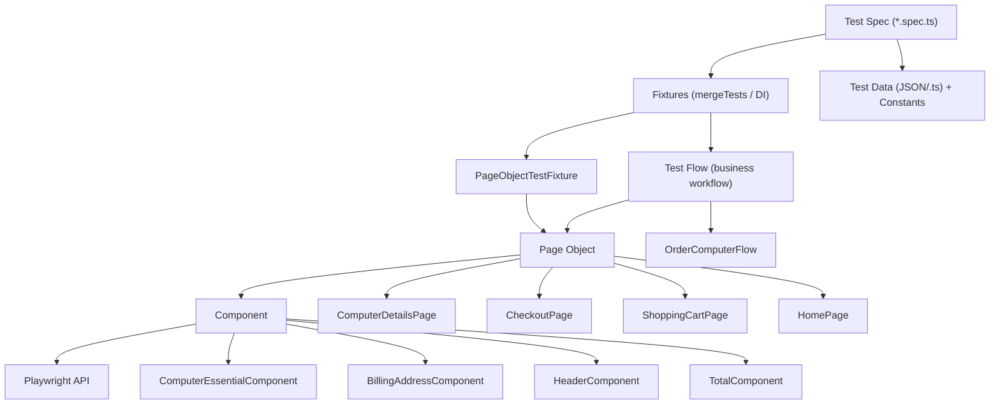
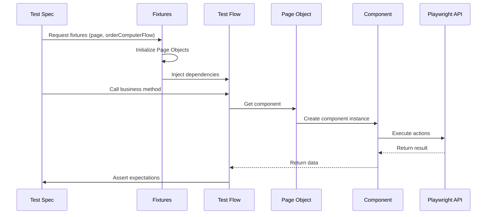
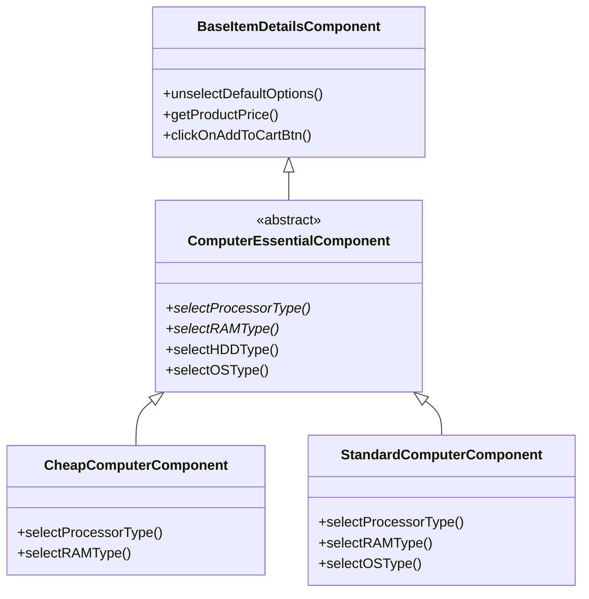
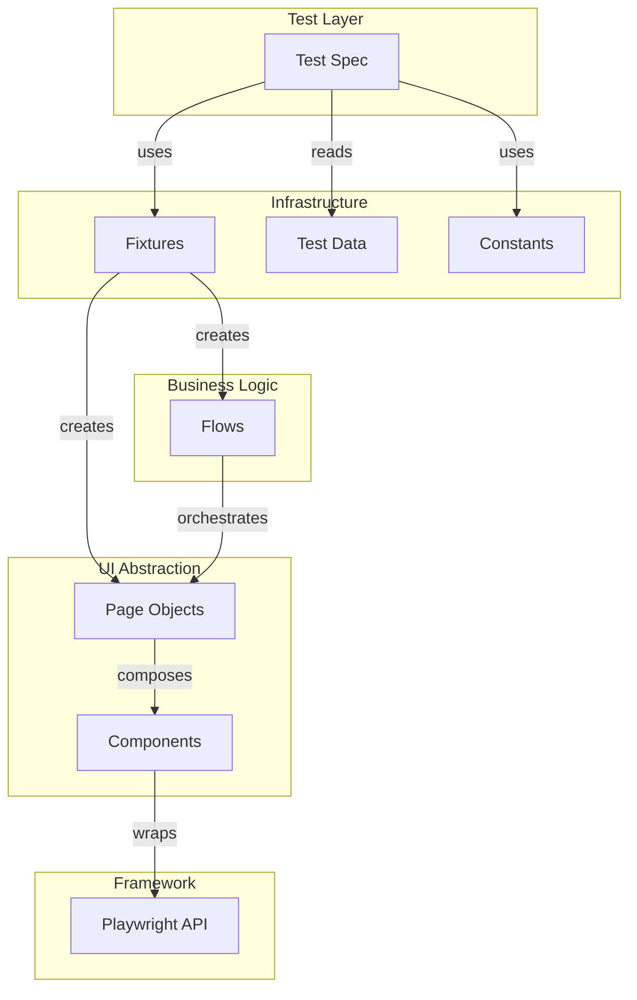
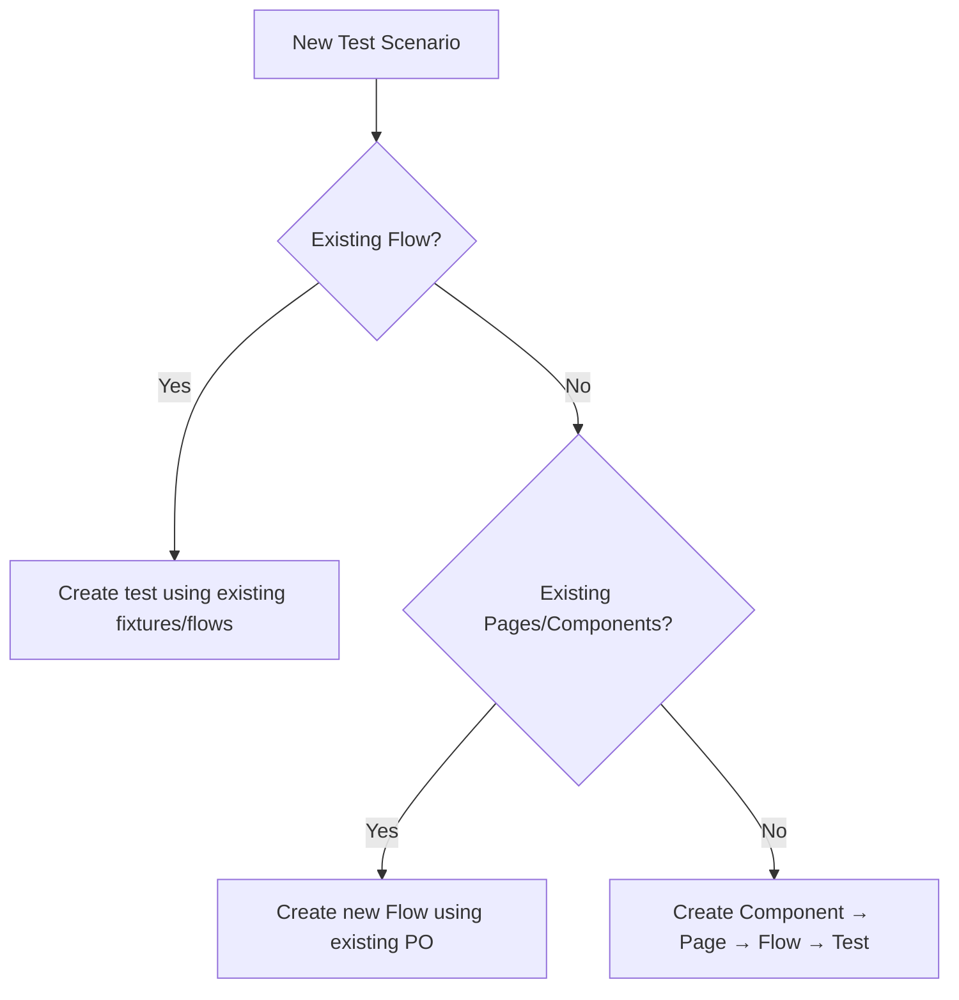

# SDETPRO K14 Playwright Automation Framework

A comprehensive end-to-end test automation framework built with Playwright and TypeScript, demonstrating advanced design patterns including Page Object Model, Component Object Pattern, Flow Pattern, and Fixture-based Dependency Injection.

---

## Table of Contents

1. [Project Overview](#1-project-overview)
2. [Project Structure](#2-project-structure)
3. [Project Setup](#3-project-setup)
4. [Configuration](#4-configuration)
5. [Framework Design](#5-framework-design)
6. [Test Design Guidelines](#6-test-design-guidelines)
7. [Environment Configuration](#7-environment-configuration)
8. [Recommendations](#8-recommendations)
9. [Playwright MCP Guide](#9-playwright-mcp-guide)

---

## 1. Project Overview

### Purpose

This framework automates end-to-end testing for the [Demo Web Shop](https://demowebshop.tricentis.com) e-commerce application. It demonstrates professional test automation architecture patterns suitable for enterprise-level projects.

### Technology Stack

| Technology | Version | Purpose |
|------------|---------|---------|
| Playwright | 1.42.1 | Browser automation engine |
| TypeScript | via `tsconfig.json` | Type-safe test development |
| Node.js | 18+ recommended | Runtime environment |
| Allure | 3.0.0-beta.3 | Test reporting |
| dotenv | ^16.x | Loads `.env.*` files for multi-environment config |
| cross-env | ^7.x | Cross-platform env variable setting for npm scripts |

### Project Hierarchy

The framework is organized as a strict top-down hierarchy — each layer only talks to the layer directly below it:



### Execution Flow



### Why This Architecture?

| Pattern | Benefit |
|---------|---------|
| **Layered Architecture** | Separation of concerns - each layer has single responsibility |
| **Fixtures for DI** | Clean dependency injection, automatic cleanup, reusable setup |
| **Flow Pattern** | Encapsulates multi-step business workflows, reusable across tests |
| **Component Pattern** | Reusable UI element interactions across multiple pages |
| **Data-Driven** | Same test logic, multiple data sets via JSON |

---

## 2. Project Structure

```
sdetpro-k14-playwright/
├── constants/           # Application constants (enums, routes, config values)
│   └── Routes.ts        # Relative route paths used with page.goto()
├── e2e/                 # Reserved for e2e tests (currently empty)
├── fixtures/            # Playwright custom fixtures
├── modules/             # Page Objects and Components
│   ├── components/      # Reusable UI components
│   │   ├── cart/        # Shopping cart components
│   │   ├── checkout/    # Checkout process components
│   │   ├── computer/    # Computer product components
│   │   └── global/      # Header, Footer components
│   └── pages/           # Page Object classes
├── test-data/           # Test data JSON/TS files
│   ├── DefaultCheckoutUser.ts    # Wraps JSON data, allows env override (TEST_USER_EMAIL)
│   └── computer/        # Computer-specific test data
├── test-flows/          # Business workflow classes
│   ├── computer/        # Computer ordering flows
│   └── global/          # Global/shared flows
├── tests/               # Test specifications
│   ├── computer/        # Computer product tests
│   ├── fixture-tests/   # Fixture demonstration tests
│   └── global/          # Global component tests
├── utils/               # Utility functions
├── .env.example         # Environment variable template (tracked)
├── .env.dev / .env.qa / .env.prod  # Per-environment config (gitignored)
├── playwright.config.js # Playwright configuration
├── tsconfig.json        # TypeScript compiler configuration
└── package.json         # Project dependencies
```

### Folder Details

#### `constants/`
**Purpose:** Store application-wide constants that don't change between environments.

| File | Purpose |
|------|---------|
| `Payment.ts` | Payment method identifiers (COD, Credit Card, etc.) |
| `CreditCardType.ts` | Credit card type values (Visa, MasterCard, etc.) |
| `Routes.ts` | Relative route paths (e.g. `buildCheapComputer`, `buildStandardComputer`) used with `page.goto()`, combined with `baseURL` per environment |

**What belongs here:**
- Payment methods, card types, shipping methods
- UI text constants for validation
- Dropdown option values
- Relative route paths (see `Routes.ts`)

**What does NOT belong here:**
- Absolute/environment-specific URLs (use `baseURL` + `Routes.ts`)
- Test data (use `test-data/`)
- Credentials (use environment variables)

#### `fixtures/`
**Purpose:** Playwright fixtures for dependency injection and test setup.

| File | Purpose |
|------|---------|
| `PageObjectTestFixture.ts` | Provides Page Object instances to tests |
| `GlobalBeforeAllFixture.ts` | Worker-scoped setup (runs once per worker) |
| `GlobalBeforeEachFixture.ts` | Test-scoped auto-setup |
| `SimpleTestFixture.ts` | Learning/demo fixture |
| `LoginBeforeTestFixture.ts` | Login setup fixture |

**Key Architecture Decision:** Fixtures do NOT navigate to URLs. Navigation is explicit in test body because different tests need different starting URLs.

```typescript
// PageObjectTestFixture.ts - NO navigation inside fixture
computerDetailsPage: async({page}, use) => {
    const computerDetailsPage = new ComputerDetailsPage(page);
    await use(computerDetailsPage);
},
```

#### `modules/components/`
**Purpose:** Reusable UI component classes representing distinct sections of pages.

**Component Hierarchy:**


**Selector Decorator Pattern:**
```typescript
// Components use @selector decorator to define their root locator
@selector(".product-essential")
export default class CheapComputerComponent extends ComputerEssentialComponent {
    // ...
}
```

#### `modules/pages/`
**Purpose:** Page Object classes representing full application pages.

| Page | Responsibility |
|------|----------------|
| `HomePage.ts` | Main landing page, provides header/footer/body components |
| `ComputerDetailsPage.ts` | Product details, uses generic factory for computer components |
| `CheckoutPage.ts` | Checkout process, provides all checkout step components |
| `ShoppingCartPage.ts` | Cart management, provides cart item and total components |
| `CheckoutOptionsPage.ts` | Guest/login checkout selection |

**Generic Component Factory:**
```typescript
// ComputerDetailsPage uses TypeScript generics for flexible component creation
computerComp<Tun extends ComputerEssentialComponent>(
    computerComponentClass: ComputerComponentConstructor<Tun>
): Tun {
    return new computerComponentClass(this.page.locator(computerComponentClass.selectorValue));
}
```

#### `test-flows/`
**Purpose:** Encapsulate multi-step business workflows that span multiple pages/components.

**OrderComputerFlow Methods:**

```mermaid
graph LR
    A[buildCompSpecAndAddToCart] --> B[verifyShoppingCart]
    B --> C[agreeTOSAndCheckout]
    C --> D[inputBillingAddress]
    D --> E[inputShippingAddress]
    E --> F[selectShippingMethod]
    F --> G[selectPaymentMethod]
    G --> H[inputPaymentInformation]
    H --> I[confirmOrder]
```


**Key Design:** Flow receives Page Objects via fixture injection, not `page` directly:
```typescript
constructor(
    private readonly fixture: Pick<PageObjectFixtures, 
        'checkoutPage' | 'checkoutOptionsPage' | 'computerDetailsPage' | 'shoppingCartPage'>
) {}
```

#### `test-data/`
**Purpose:** JSON files containing test data for data-driven tests.

| File | Structure |
|------|-----------|
| `CheapComputerData.json` | Array of computer configurations (processor, RAM, HDD, software) |
| `StandardComputerData.json` | Standard computer configurations with OS options |
| `DefaultCheckoutUser.json` | Raw default user information for checkout |
| `DefaultCheckoutUser.ts` | Wraps `DefaultCheckoutUser.json`, overriding `email` with `process.env.TEST_USER_EMAIL` when set. **Import this file (not the raw JSON) in flows/tests.** |
| `DefaultCheckoutCardData.json` | Default credit card information |

#### `tests/`
**Purpose:** Test specification files organized by feature.

**Naming Convention:** `{Feature}{Type}Test.spec.ts`
- `CheapComputerTest.spec.ts` - Main cheap computer test
- `CheapComputerFixtureTest.spec.ts` - Fixture-based variant
- `GenericComponentTest.spec.ts` - Generic type system demonstration

---

## 3. Project Setup

### Prerequisites

| Requirement | Version | Purpose |
|-------------|---------|---------|
| Node.js | 18.x or higher | JavaScript runtime |
| npm | 9.x or higher | Package manager |
| Git | Any recent | Version control |
| VS Code | Latest | Recommended IDE |

### VS Code Extensions (Recommended)

- **Playwright Test for VSCode** - Test running and debugging
- **ESLint** - Code linting
- **Prettier** - Code formatting
- **TypeScript** - Language support

### Installation Steps

```bash
# 1. Clone the repository
git clone <repository-url>
cd sdetpro-k14-playwright

# 2. Install dependencies
npm install

# 3. Install Playwright browsers
npx playwright install chromium

# 4. Verify installation
npx playwright test --list
```

### Running Tests

| Command | Purpose |
|---------|---------|
| `npm test` | Run all tests (headed mode) |
| `npm run ui` | Open Playwright UI mode |
| `npx playwright test` | Run all tests |
| `npx playwright test computer/` | Run computer folder tests only |
| `npx playwright test CheapComputerTest` | Run specific test file |
| `npx playwright test --headed` | Run with browser visible |
| `npx playwright test --debug` | Debug mode with inspector |
| `npx playwright test --ui` | Interactive UI mode |
| `npx playwright test --project=chromium` | Run on specific browser |

### Generating Reports

```bash
# HTML Report (generated automatically after test run)
npx playwright show-report

# Allure Report
npx allure generate allure-results --clean
npx allure open
```

---

## 4. Configuration

### playwright.config.js

```javascript
const { defineConfig, devices } = require('@playwright/test');
require('dotenv').config({ path: `.env.${process.env.ENV || 'qa'}` }); // Loads .env.<ENV> (default: qa)

module.exports = defineConfig({
    testDir: './tests',                    // Root directory for test files
    projects: [
        {
            name: 'chromium',
            use: { ...devices['Desktop Chrome'] },
        },
    ],
    reporter: [
        ['html', {open: 'never'}],         // HTML report, don't auto-open
        ['allure-playwright'],              // Allure integration
    ],
    retries: process.env.CI ? 2 : 1,       // More retries in CI
    use: {
        baseURL: process.env.BASE_URL || 'https://demowebshop.tricentis.com',  // Base URL for page.goto, driven by .env.*
        actionTimeout: 5 * 1000,           // Timeout for actions (5 seconds)
        trace: 'on-first-retry',           // Capture trace on retry
        video: 'on-first-retry',           // Record video on retry
        screenshot: 'only-on-failure',     // Screenshot on failure
        headless: process.env.HEADLESS === 'true'  // Driven by .env.* (true in CI/prod)
    }
});
```

### Configuration Properties Explained

| Property | Current Value | Purpose | When to Modify |
|----------|---------------|---------|----------------|
| `testDir` | `'./tests'` | Where Playwright looks for test files | If restructuring test locations |
| `projects` | `['chromium']` | Browser configurations to run | Add Firefox/WebKit for cross-browser |
| `retries` | `1 (local), 2 (CI)` | Auto-retry failed tests | Increase for flaky environments |
| `baseURL` | `process.env.BASE_URL` (per `.env.*`) | Prepended to relative URLs | Edit `.env.dev` / `.env.qa` / `.env.prod` (see Section 7) |
| `actionTimeout` | `5000ms` | Max wait for actions | Increase for slow networks |
| `headless` | `process.env.HEADLESS === 'true'` | Run without UI | Set `HEADLESS=true` in `.env.prod`/CI |
| `trace` | `'on-first-retry'` | Record detailed trace | Set `'on'` for debugging |
| `video` | `'on-first-retry'` | Record test video | Useful for debugging |
| `screenshot` | `'only-on-failure'` | Capture screenshots | Change to `'on'` if needed |

### Adding Multi-Browser Support

```javascript
projects: [
    { name: 'chromium', use: { ...devices['Desktop Chrome'] } },
    { name: 'firefox', use: { ...devices['Desktop Firefox'] } },
    { name: 'webkit', use: { ...devices['Desktop Safari'] } },
    { name: 'mobile', use: { ...devices['Pixel 5'] } },
],
```

---

## 5. Framework Design

### Design Patterns Used

#### 1. Page Object Model (POM)

**What:** Classes that represent application pages, encapsulating page structure and interactions.

**Why:** 
- Single point of maintenance for page changes
- Readable test code
- Reusable page interactions

**Implementation:**
```typescript
// modules/pages/CheckoutPage.ts
export default class CheckoutPage {
    constructor(private page: Page) {}
    
    public billingAddressComponent(): BillingAddressComponent {
        return new BillingAddressComponent(
            this.page.locator(BillingAddressComponent.selectorValue)
        );
    }
}
```

#### 2. Component Object Pattern

**What:** Reusable classes representing UI components that appear across multiple pages.

**Why:**
- Avoid duplication for shared UI elements (header, footer)
- Encapsulate complex component logic
- Support composition in Page Objects

**Implementation:**
```typescript
// modules/components/global/header/HeaderComponent.ts
export default class HeaderComponent {
    public static selector: string = ".header";
    
    constructor(private component: Locator) {}
    
    public async clickOnShoppingCartLink(): Promise<void> {
        await this.component.locator(this.shoppingCartLink).click();
    }
}
```

#### 3. Flow Pattern

**What:** Classes that orchestrate multi-step business workflows spanning multiple pages.

**Why:**
- Tests remain focused on "what" not "how"
- Reusable complex workflows
- Business logic separated from UI interactions

**Implementation:**
```typescript
// test-flows/computer/OrderComputerFlow.ts
export default class OrderComputerFlow {
    async buildCompSpecAndAddToCart(componentClass, data): Promise<void> {
        const computerComp = this.fixture.computerDetailsPage.computerComp(componentClass);
        await computerComp.selectProcessorType(data.processorType);
        await computerComp.selectRAMType(data.ram);
        // ... more steps
    }
}
```

#### 4. Fixture Pattern (Dependency Injection)

**What:** Playwright fixtures provide test dependencies through constructor injection.

**Why:**
- Automatic resource cleanup
- Declarative dependencies
- Composable via `mergeTests`

**Implementation:**
```typescript
// fixtures/PageObjectTestFixture.ts
export const test = pageObjectFixture.extend<PageObjectFixtures>({
    computerDetailsPage: async({page}, use) => {
        const computerDetailsPage = new ComputerDetailsPage(page);
        await use(computerDetailsPage);
    },
});

// test-flows/computer/OrderComputerFlow.ts
export const test = mergeTests(pageObjectFixtures, globalTestAll)
    .extend<{ orderComputerFlow: OrderComputerFlow }>({
        orderComputerFlow: async ({ checkoutPage, ... }, use) => {
            const flow = new OrderComputerFlow({ checkoutPage, ... });
            await use(flow);
        }
    });
```

#### 5. Data-Driven Testing

**What:** Same test logic executed with multiple data sets from JSON files.

**Why:**
- Comprehensive coverage with minimal code
- Easy to add new test cases
- Data separated from logic

**Implementation:**
```typescript
// tests/computer/CheapComputerTest.spec.ts
import testData from '../../test-data/computer/CheapComputerData.json';

testData.forEach(computerData => {
    test(`Test computer | RAM: ${computerData.ram}`, async ({ orderComputerFlow }) => {
        await orderComputerFlow.buildCompSpecAndAddToCart(
            CheapComputerComponent, 
            computerData
        );
    });
});
```

#### 6. Decorator Pattern

**What:** TypeScript decorators for component selector metadata.

**Why:**
- Declarative selector definition
- Selector available as static property
- Cleaner component instantiation

**Implementation:**
```typescript
// modules/components/SelectorDecorator.ts
export function selector(selectorValue: any) {
    return function (target: any) {
        target.selectorValue = selectorValue;
    }
}

// Usage
@selector(".product-essential")
export default class CheapComputerComponent { }
```

### Pattern Relationships



---

## 6. Test Design Guidelines

### Creating a New Test

#### Step 1: Identify the Test Scenario

Determine if you need:
- A new Flow (multi-step business process)
- New Page Objects/Components (new UI elements)
- New test data (different input combinations)
- Just a new test using existing infrastructure

#### Step 2: Choose the Right Approach



#### Step 3: Layer Responsibilities

| Layer | Responsibilities | Code Examples |
|-------|-----------------|---------------|
| **Test** | Define test cases, use fixtures, assert outcomes | `test('name', async ({ flow }) => { })` |
| **Fixture** | Provide dependencies, no navigation | `await use(new PageObject(page))` |
| **Flow** | Orchestrate business steps, assertions | `await flow.buildAndAddToCart()` |
| **Page Object** | Expose components, page-level actions | `return new Component(locator)` |
| **Component** | Encapsulate element interactions | `await this.component.locator().click()` |

### Test File Template

```typescript
import { test } from '../../test-flows/computer/OrderComputerFlow';
import CheapComputerComponent from '../../modules/components/computer/CheapComputerComponent';
import testData from '../../test-data/computer/CheapComputerData.json';
import PAYMENT_METHOD from '../../constants/Payment';
import CREDIT_CARD_TYPE from '../../constants/CreditCardType';
import ROUTES from '../../constants/Routes';

testData.forEach(computerData => {
    test(`Test scenario | ${computerData.ram}`, async ({ page, orderComputerFlow }) => {
        // 1. Navigate (explicit in test body, using the Routes constant)
        await page.goto(ROUTES.buildCheapComputer);
        
        // 2. Execute business flow
        await orderComputerFlow.buildCompSpecAndAddToCart(CheapComputerComponent, computerData);
        await orderComputerFlow.verifyShoppingCart();
        
        // 3. Complete checkout
        await orderComputerFlow.agreeTOSAndCheckout();
        await orderComputerFlow.inputBillingAddress();
        await orderComputerFlow.inputShippingAddress();
        await orderComputerFlow.selectShippingMethod();
        await orderComputerFlow.selectPaymentMethod(PAYMENT_METHOD.creditCard);
        await orderComputerFlow.inputPaymentInformation(CREDIT_CARD_TYPE.discover);
        await orderComputerFlow.confirmOrder();
    });
});
```

### Best Practices

#### DO:
- ✅ Import `test` from Flow (includes merged fixtures)
- ✅ Navigate explicitly in test body with `page.goto()`
- ✅ Use constants for magic strings
- ✅ Use data-driven approach for variations
- ✅ Keep tests focused on one scenario
- ✅ Use meaningful test names

#### DON'T:
- ❌ Put navigation inside fixtures (except worker-scoped warmup)
- ❌ Create Playwright locators directly in tests
- ❌ Hardcode test data in test files
- ❌ Mix assertions across multiple flows
- ❌ Use `page.waitForTimeout()` (use proper waits)

### Creating New Components

```typescript
import { Locator } from "@playwright/test";
import { selector } from "../SelectorDecorator";

@selector("#my-component-root")
export default class MyNewComponent {
    protected component: Locator;
    
    // Private selectors (relative to component root)
    private submitBtnSel = 'button[type="submit"]';
    
    constructor(component: Locator) {
        this.component = component;
    }
    
    // Public action methods
    public async clickSubmit(): Promise<void> {
        await this.component.locator(this.submitBtnSel).click();
    }
    
    // Public getter methods
    public async getErrorMessage(): Promise<string> {
        return await this.component.locator('.error').textContent();
    }
}
```

---

## 7. Environment Configuration

### Implemented Setup

Multi-environment configuration is implemented using `dotenv` + per-environment files. `playwright.config.js` loads `.env.${ENV}` (default `qa`) and reads `BASE_URL` / `HEADLESS` from it:

```javascript
// playwright.config.js
require('dotenv').config({ path: `.env.${process.env.ENV || 'qa'}` });

module.exports = defineConfig({
    use: {
        baseURL: process.env.BASE_URL || 'https://demowebshop.tricentis.com',
        headless: process.env.HEADLESS === 'true'
    }
});
```

| File | Purpose | Tracked in Git? |
|------|---------|------------------|
| `.env.example` | Template documenting all variables | Yes |
| `.env.dev` | Dev environment values | No (gitignored) |
| `.env.qa` | QA environment values (default) | No (gitignored) |
| `.env.prod` | Prod environment values (`HEADLESS=true`) | No (gitignored) |

**One-time prerequisite** (not yet run in this workspace):
```bash
npm install dotenv cross-env --save-dev
```

**Running against an environment:**

```powershell
# PowerShell
$env:ENV="dev"; npx playwright test
$env:ENV="qa"; npx playwright test
$env:ENV="prod"; npx playwright test
Example:
$env:ENV="dev"; npx playwright test tests/computer/CheapComputerFixtureTest.spec.ts
```

**Recommended npm scripts** (add to `package.json`, requires `cross-env` for cross-platform support):
```json
"scripts": {
  "test:dev": "cross-env ENV=dev playwright test",
  "test:qa": "cross-env ENV=qa playwright test",
  "test:prod": "cross-env ENV=prod playwright test"
}
```
```bash
npm run test:dev
npm run test:qa
```

### Alternative: Playwright Projects

For cases where you want per-environment `baseURL` without `.env` files, `projects` can be used instead:

```javascript
projects: [
    { name: 'dev', use: { ...devices['Desktop Chrome'], baseURL: 'https://dev.demowebshop.tricentis.com' } },
    { name: 'qa',  use: { ...devices['Desktop Chrome'], baseURL: 'https://qa.demowebshop.tricentis.com' } },
],
```
```bash
npx playwright test --project=dev
```

### Handling Credentials

`test-data/DefaultCheckoutUser.ts` wraps the raw `DefaultCheckoutUser.json` and overrides `email` with `process.env.TEST_USER_EMAIL` when set, so no real-looking email is hardcoded into what tests actually use:

```typescript
// test-data/DefaultCheckoutUser.ts
import defaultUserData from './DefaultCheckoutUser.json';

const DefaultCheckoutUser = {
    ...defaultUserData,
    email: process.env.TEST_USER_EMAIL || defaultUserData.email,
};

export default DefaultCheckoutUser;
```

> Always import this `.ts` wrapper (not the raw `.json`) in flows/tests that need checkout user data.

---

## 8. Recommendations

## 9. Playwright MCP Guide

For browser-driven exploration before writing automation, see [PLAYWRIGHT_MCP_GUIDE.md](PLAYWRIGHT_MCP_GUIDE.md).

### Code Quality Improvements (Not Yet Implemented)

1. **Add ESLint + Prettier** for consistent code style
2. **Add pre-commit hooks** for automated checks
3. **Add test tagging** for selective test execution:
   ```typescript
   test('scenario @smoke @checkout', async () => { });
   ```
4. **Add parallel execution** configuration:
   ```javascript
   fullyParallel: true,
   workers: process.env.CI ? 2 : undefined,
   ```

---

## Quick Reference

### Common Commands

```bash
# Run all tests
npm test

# Run specific folder
npx playwright test computer/

# Run with UI
npm run ui

# Debug mode
npx playwright test --debug

# Generate report
npx playwright show-report
npx allure generate allure-results && npx allure open
```

### File Naming Conventions

| Type | Convention | Example |
|------|------------|---------|
| Test | `{Feature}Test.spec.ts` | `CheapComputerTest.spec.ts` |
| Page | `{PageName}Page.ts` | `CheckoutPage.ts` |
| Component | `{ComponentName}Component.ts` | `BillingAddressComponent.ts` |
| Flow | `{Feature}Flow.ts` | `OrderComputerFlow.ts` |
| Fixture | `{Purpose}Fixture.ts` | `PageObjectTestFixture.ts` |
| Test Data | `{Feature}Data.json` | `CheapComputerData.json` |
| Constants | `{Domain}.ts` | `Payment.ts` |

---

*Last Updated: 2026-07-30*
